# Tutorial: Data-Structure-and-Algorithm

This project, `Data-Structure-and-Algorithm`, serves as a **comprehensive collection** of fundamental algorithms and data structures. It provides *practical implementations* and *explanations* for common computational problems across various domains like graph theory, sorting, and number theory. It's designed to illustrate how these core concepts are stored and manipulated to solve problems efficiently.


## Visual Overview

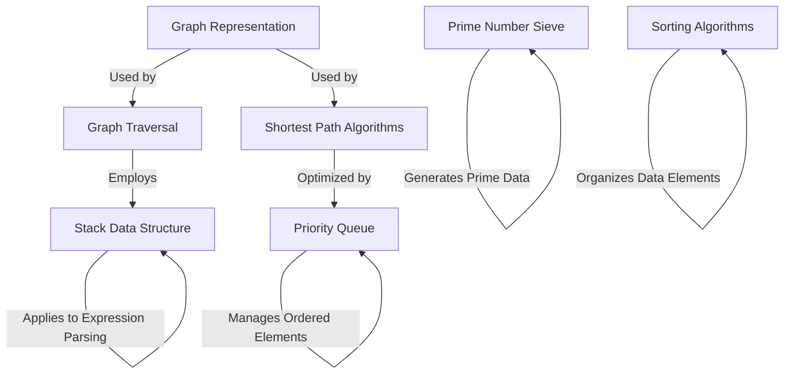

## Chapters

1. [Stack Data Structure
](01_stack_data_structure_.md)
2. [Sorting Algorithms
](02_sorting_algorithms_.md)
3. [Prime Number Sieve
](03_prime_number_sieve_.md)
4. [Priority Queue
](04_priority_queue_.md)
5. [Graph Representation
](05_graph_representation_.md)
6. [Graph Traversal
](06_graph_traversal_.md)
7. [Shortest Path Algorithms
](07_shortest_path_algorithms_.md)

---

# Chapter 1: Stack Data Structure

Welcome to the exciting world of Data Structures and Algorithms! We're starting our journey with a fundamental concept: the **Stack Data Structure**. Don't worry if these terms sound intimidating; we'll break them down step by step, using simple analogies and practical examples.

## What Problem Does a Stack Solve?

Imagine you're browsing the internet. You click on a link, then another, then another. If you want to go back to a previous page, you simply click the "back" button, and you magically return to the page you just left. How does your browser remember the order of pages you visited? Or, think about your favorite text editor. When you make a mistake, you hit "undo," and the last change you made disappears. How does the editor know which action was the *last* one to undo?

These are perfect examples of where a **Stack** comes in handy! A stack is a simple yet powerful way to manage data, especially when you need to keep track of things in a specific order: the last thing you added is the first thing you need to access.

## The Stack: A Real-World Analogy

The best way to understand a stack is to think of a **stack of plates** in a kitchen cabinet:

*   **Adding a plate:** You can only put a new plate on **top** of the existing stack.
*   **Removing a plate:** You can only take the plate from the **top** of the stack. You wouldn't pull a plate from the middle or bottom, right?

This "last-in, first-out" behavior is the core principle of a Stack. We call it **LIFO**. The plate you put *last* on the stack is the *first* one you take off.

## Core Stack Operations

Just like with our plate stack, there are specific actions you can perform on a data stack:

| Operation | Description                                                                         | Analogy (Plates)              |
| :-------- | :---------------------------------------------------------------------------------- | :---------------------------- |
| **Push**  | Adds a new item to the very **top** of the stack.                                   | Putting a new plate on top.   |
| **Pop**   | Removes and returns the item from the very **top** of the stack.                    | Taking the topmost plate away. |
| **Top**   | Looks at (but doesn't remove) the item currently at the **top** of the stack.       | Peeking at the top plate.     |
| **isEmpty** | Checks if the stack has any items in it.                                            | Checking if there are any plates left. |
| **isFull**  | Checks if the stack has reached its maximum capacity (if it has one).               | Checking if the cabinet is full of plates. |

## Using a Stack: Reversing a Word

Let's try to solve a simple problem using a stack: **reversing a word**. For example, turning "HELLO" into "OLLEH".

Here's how we can do it with a stack:

1.  **Push** each letter of the word "HELLO" onto the stack, one by one.
2.  Once all letters are pushed, **Pop** them out one by one. Because of the LIFO rule, the last letter pushed ("O") will be the first one popped, then "L", and so on.

Let's trace this with "HELLO":

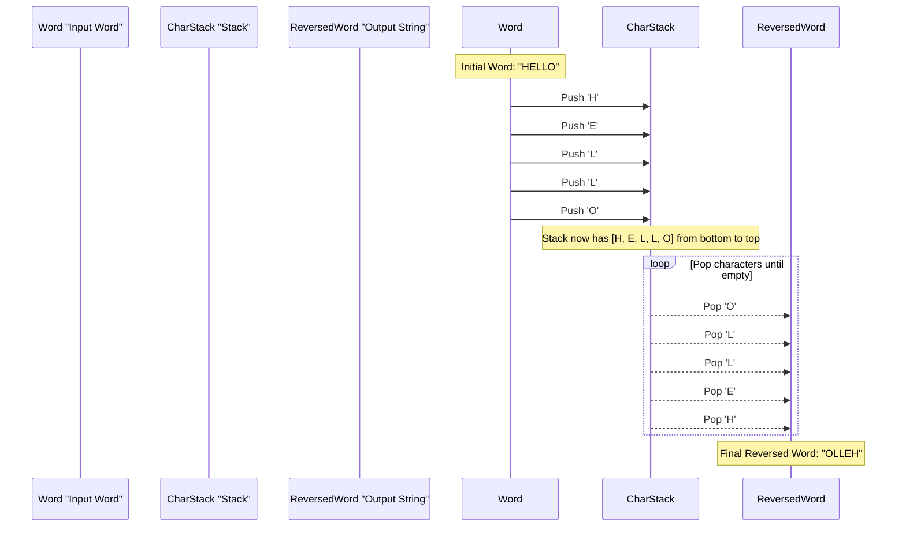

### Code Example (Using C++ `std::stack`)

Most programming languages provide a built-in stack feature. In C++, we can use `std::stack`, which is part of the Standard Template Library (STL). It simplifies things a lot!

Here's a very simple C++ example for reversing a word:

```cpp
#include <iostream>
#include <stack>   // Required for std::stack
#include <string>

int main() {
    std::string word = "HELLO";
    std::stack<char> charStack; // Create a stack to hold characters

    // Step 1: Push characters onto the stack
    for (char c : word) {
        charStack.push(c); // Add character to the top
    }

    // Step 2: Pop characters to form the reversed word
    std::string reversedWord = "";
    while (!charStack.empty()) { // As long as the stack is not empty
        reversedWord += charStack.top(); // Get the topmost character
        charStack.pop();                 // Remove the topmost character
    }
    std::cout << "Original: " << word << std::endl;
    std::cout << "Reversed: " << reversedWord << std::endl;
    return 0;
}
```

**Output:**
```
Original: HELLO
Reversed: OLLEH
```

As you can see, the `std::stack` makes the `push` and `pop` operations very straightforward. We first push "H", then "E", "L", "L", "O". When we pop, "O" comes out first, then "L", and so on, giving us the reversed word.

Another common use for stacks is checking if parentheses in an expression are balanced (e.g., `({[]})` is balanced, `([)]` is not). This is shown in `Level_02/Balanced_Parenthesis.cpp`, where a `std::stack<char>` is used to match opening and closing brackets.

## How Stacks Work Internally (Under the Hood)

You might be wondering, how is a stack actually built in a computer's memory? Often, stacks are implemented using something called an **array** or a **linked list**. For simplicity, let's think of it as an array (a fixed-size list of storage spots).

Imagine our `SimpleStack` is an array called `data` and a special variable called `top`.

*   `data`: This is where we store the actual items.
*   `top`: This integer variable keeps track of the **index** (position) of the most recently added item in our `data` array. When the stack is empty, `top` is typically set to `-1`.

Let's trace how `push` and `pop` would work with this internal structure:

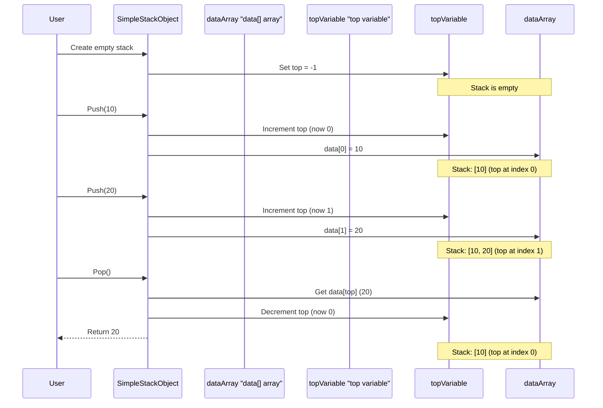

### Simplified C++ Internal Implementation

The files `Level_01/06_Stack/Stack_Operation.cpp` and `Level_01/06_Stack/Stack_Operation_With_Array.cpp` show basic ways to implement a stack using C++ arrays. Here's a highly simplified version to illustrate the core idea:

```cpp
// From Level_01/06_Stack/Stack_Operation.cpp and Stack_Operation_With_Array.cpp
#define MAX_SIZE 5 // Our small stack can hold 5 items

struct MySimpleStack {
    int top;         // Index of the top element
    int data[MAX_SIZE]; // The array to store items
};

// Function to add an item (Push operation)
void myPush(MySimpleStack* s, int item) {
    // Check if the stack is full
    if (s->top < MAX_SIZE - 1) { // If top is not at the last index
        s->top++;                // Move top up
        s->data[s->top] = item;  // Place item at new top
    }
    // Else: stack is full (overflow)
}

// Function to remove an item (Pop operation)
int myPop(MySimpleStack* s) {
    // Check if the stack is empty
    if (s->top != -1) { // If top is not -1 (empty)
        int item = s->data[s->top]; // Get item from top
        s->top--;                   // Move top down
        return item;
    }
    return -1; // Indicate stack was empty (underflow)
}
```

In this code:
*   `MySimpleStack` holds our `data` array and the `top` index.
*   `myPush` increments `top` first, then stores the new `item`.
*   `myPop` retrieves the `item` from `top`, then decrements `top`.
*   Checks like `s->top < MAX_SIZE - 1` (for `myPush`) and `s->top != -1` (for `myPop`) are essential to prevent errors like trying to add to a full stack (overflow) or remove from an empty stack (underflow). You can see these checks implemented in `Level_01/06_Stack/stack_implementing.cpp` and `Level_01/06_Stack/Stack_Operation_With_Array.cpp`.

## More Applications of Stacks

Beyond reversing words and browser history, stacks are used in many other areas:

*   **Function Calls:** When you write a program and one function calls another, the computer uses a stack to keep track of where to return after each function finishes.
*   **Expression Evaluation:** Stacks are crucial for converting and evaluating mathematical expressions (like converting "2 + 3" to a form easier for computers to process).
*   **Undo/Redo Features:** As mentioned, stacks power the undo/redo functionality in many applications.
*   **Depth-First Search (DFS):** An important algorithm for exploring graphs (which we'll cover later in [Graph Traversal](06_graph_traversal_.md)) often uses a stack to manage its exploration path. You can see an example of this in `Level_04/02_Graph Traversal Using DFS/Dfs_Stack.cpp`.

## Conclusion

The Stack Data Structure is a foundational concept in computer science. It's a simple, linear data structure that follows the **Last-In, First-Out (LIFO)** principle, just like a stack of plates. We learned about its core operations: `push` (add), `pop` (remove), `top` (peek), `isEmpty`, and `isFull`. We also saw how it can be used to solve practical problems like reversing a word and understood its basic internal implementation using an array. Stacks are incredibly versatile and form the basis for many more complex algorithms and systems.

Ready to explore another fundamental concept? In our next chapter, we'll dive into different ways to organize data efficiently with [Sorting Algorithms](02_sorting_algorithms_.md).

---

# Chapter 2: Sorting Algorithms

Welcome back to our journey through Data Structures and Algorithms! In our [previous chapter on Stacks](01_stack_data_structure_.md), we learned about a special way to store data where the last item in is the first item out, like a stack of plates. Now, let's explore a different, but equally important, concept: **Sorting Algorithms**.

## What Problem Do Sorting Algorithms Solve?

Imagine your bookshelf is a complete mess! Books are scattered everywhere, not in any particular order. To find a specific book quickly, you'd probably want to arrange them, maybe by author name, title, or publication date. This act of arranging items into a specific sequence is exactly what **sorting algorithms** do in the world of computers!

Think of it like this:
*   You have a list of test scores, and you want to see who got the highest. You need to sort them from highest to lowest.
*   You're looking for a product on an online store, and you want to see the cheapest ones first. You sort by price, ascending.
*   You have a list of names, and you want them in alphabetical order.

Sorting algorithms are systematic ways to arrange items in a list (like numbers in an array or names in a list) into a specific order, either **ascending** (smallest to largest, A to Z) or **descending** (largest to smallest, Z to A).

## The Idea Behind Sorting

At its core, sorting is about putting things in order. Just like you have different ways to organize your books (by color, size, author), computers have different methods, or "algorithms," to sort data.

Let's start with a very simple and intuitive sorting method called **Bubble Sort**.

## Bubble Sort: A Gentle Introduction

Imagine you have a row of bubbles in a glass, each with a number written on it: `[5, 1, 4, 2]`. You want to sort them from smallest to largest.

Bubble Sort works by repeatedly stepping through the list, comparing adjacent items, and swapping them if they are in the wrong order. Think of it like lighter bubbles "bubbling up" to their correct position.

Let's sort `[5, 1, 4, 2]` in ascending order:

**First Pass:**
1.  Compare `5` and `1`. Is `5` greater than `1`? Yes. **Swap them.**
    List: `[1, 5, 4, 2]`
2.  Now compare `5` and `4`. Is `5` greater than `4`? Yes. **Swap them.**
    List: `[1, 4, 5, 2]`
3.  Next, compare `5` and `2`. Is `5` greater than `2`? Yes. **Swap them.**
    List: `[1, 4, 2, 5]`
    *Notice how the largest element, `5`, has "bubbled" to the end of the list after this pass. It's now in its correct sorted position.*

**Second Pass:** (We don't need to check `5` again, as it's sorted)
1.  Compare `1` and `4`. Is `1` greater than `4`? No. **Do nothing.**
    List: `[1, 4, 2, 5]`
2.  Compare `4` and `2`. Is `4` greater than `2`? Yes. **Swap them.**
    List: `[1, 2, 4, 5]`
    *Now `4` is in its correct place.*

**Third Pass:** (We don't need to check `4` or `5` again)
1.  Compare `1` and `2`. Is `1` greater than `2`? No. **Do nothing.**
    List: `[1, 2, 4, 5]`
    *The list is now sorted!*

Here's how this looks visually:

```mermaid
sequenceDiagram
    participant Array "List: [4, 2, 1]"
    Note over Array: Sorting [4, 2, 1] in ascending order

    Array->>Array: Pass 1
    Note over Array: Compare 4 and 2
    Array->>Array: Swap (4 > 2)
    Array->>Array: List becomes [2, 4, 1]
    Note over Array: Compare 4 and 1
    Array->>Array: Swap (4 > 1)
    Array->>Array: List becomes [2, 1, 4]
    Note over Array: Largest element (4) is now at the end

    Array->>Array: Pass 2
    Note over Array: Compare 2 and 1
    Array->>Array: Swap (2 > 1)
    Array->>Array: List becomes [1, 2, 4]
    Note over Array: Next largest element (2) is in place

    Note over Array: List is now sorted: [1, 2, 4]
```

## Bubble Sort: Code Example

Let's see a simplified C++ example of Bubble Sort. This code is inspired by `Level_01/01_Basic Operation With Array/Sorting/bubble_sort.cpp` and `Level_05/Bubble Sort Algorithm.cpp`.

```cpp
#include <iostream> // For input/output

void bubbleSort(int arr[], int n) {
    // Loop through all elements
    for (int i = 0; i < n - 1; i++) {
        // In each pass, compare adjacent elements
        for (int j = 0; j < n - i - 1; j++) {
            // If the element on the left is greater than the one on the right, swap them
            if (arr[j] > arr[j + 1]) {
                int temp = arr[j];      // Store left element temporarily
                arr[j] = arr[j + 1];    // Move right element to left
                arr[j + 1] = temp;      // Put stored element on the right
            }
        }
    }
}

int main() {
    int numbers[] = {5, 1, 4, 2, 8};
    int n = sizeof(numbers) / sizeof(numbers[0]); // Calculate size of array

    std::cout << "Before sorting: ";
    for (int i = 0; i < n; i++) {
        std::cout << numbers[i] << " ";
    }
    std::cout << std::endl;

    bubbleSort(numbers, n); // Call our sorting function

    std::cout << "After sorting:  ";
    for (int i = 0; i < n; i++) {
        std::cout << numbers[i] << " ";
    }
    std::cout << std::endl;

    return 0;
}
```

**Output:**
```
Before sorting: 5 1 4 2 8 
After sorting:  1 2 4 5 8 
```

In this code:
*   The `bubbleSort` function takes an array `arr` and its `n` size.
*   The **outer loop** (`for (int i = 0; i < n - 1; i++)`) controls how many passes we make. Each pass ensures that one more element is correctly placed at the end.
*   The **inner loop** (`for (int j = 0; j < n - i - 1; j++)`) does the actual comparisons and swaps of adjacent elements. We subtract `i` because the last `i` elements are already sorted and don't need to be checked again.
*   The `if (arr[j] > arr[j + 1])` checks if elements are out of order.
*   The three lines with `temp` perform the **swap**. It's like needing a temporary holding spot when you're swapping two items in your hands.

This example sorts numbers, but you can adapt it to sort other things, like words (alphabetically) or even custom objects based on their properties, just like the `Document` example in `Level_05/Bubble Sort Algorithm.cpp` sorts documents by date.

## Other Common Sorting Algorithms

Bubble Sort is simple to understand, but it's not the most efficient for large lists. There are many other sorting algorithms, each with its own way of getting the job done, some faster and some more complex.

Here are a few more you'll encounter:

### 1. Selection Sort

*   **Idea:** Imagine you want to find the smallest book on your messy shelf and put it in the first spot. Then find the smallest among the *remaining* books and put it in the second spot, and so on.
*   **How it works:** It repeatedly finds the minimum (or maximum) element from the unsorted part of the list and puts it at the beginning (or end) of the sorted part.
*   You can see an example in `Level_01/01_Basic Operation With Array/Sorting/selection_sort.cpp`.

### 2. Insertion Sort

*   **Idea:** Think of sorting a hand of playing cards. You pick up cards one by one and insert them into their correct position among the cards you've already sorted.
*   **How it works:** It builds the final sorted array one item at a time. It iterates through the input elements and consumes one input element in each iteration to place it in its correct place among the sorted elements examined so far.
*   You can find this in `Level_01/01_Basic Operation With Array/Sorting/insertion_sort.cpp`.

### 3. Merge Sort

*   **Idea:** "Divide and Conquer!" If you have a huge stack of books, it's easier to split it into two smaller stacks, sort each smaller stack, and then combine (merge) the two sorted stacks back together.
*   **How it works:** It recursively divides the array into two halves until it gets to single-element arrays (which are sorted by definition). Then, it merges those sorted halves back together in a sorted manner.
*   See `Level_01/01_Basic Operation With Array/Sorting/merge_sort.cpp` for its implementation.

### 4. Quick Sort

*   **Idea:** Pick one book (called a "pivot"). Then, rearrange all other books so that books "smaller" than the pivot are on one side, and books "larger" than the pivot are on the other. Then, do the same thing for the "smaller" and "larger" sections.
*   **How it works:** It picks an element as a "pivot" and partitions the given array around the picked pivot. It then recursively sorts the sub-arrays.
*   An example is available in `Level_01/01_Basic Operation With Array/Sorting/quick_sort.cpp`.

## Why So Many Sorting Algorithms?

You might wonder, why do we need so many ways to sort? It's because different algorithms have different **trade-offs**:

*   **Speed:** Some algorithms are much faster than others, especially for very large lists of data.
*   **Memory Usage:** Some algorithms need extra temporary space to sort, while others sort "in-place" without much extra memory.
*   **Simplicity:** Some are very easy to understand and write, while others are more complex.

For small lists, the choice of algorithm might not matter much. But for millions or billions of items, choosing the right sorting algorithm can make a huge difference in how fast your program runs!

## Conclusion

Sorting algorithms are fundamental tools in computer science that help us arrange data in a meaningful order. We've introduced the concept by imagining a messy bookshelf and learned about **Bubble Sort**, a simple algorithm that repeatedly compares and swaps adjacent elements until the list is ordered. We also briefly touched upon other important sorting methods like Selection Sort, Insertion Sort, Merge Sort, and Quick Sort, understanding that each has its unique approach and trade-offs.

With a solid understanding of sorting, you're now ready to tackle more exciting challenges! In our next chapter, we'll explore another powerful concept: [Prime Number Sieve](03_prime_number_sieve_.md), which helps us find prime numbers efficiently.

---

# Chapter 3: Prime Number Sieve

Welcome back to our exciting journey through Data Structures and Algorithms! In our [previous chapter on Sorting Algorithms](02_sorting_algorithms_.md), we explored different ways to arrange data in a specific order, like putting books on a shelf alphabetically. Now, let's switch gears and dive into a special technique for finding particular types of numbers: the **Prime Number Sieve**.

## What Problem Does a Prime Number Sieve Solve?

Imagine you're a detective, and your mission is to find all the "special" numbers up to a certain limit – say, up to 100. These special numbers are called **prime numbers**.

**What is a Prime Number?**
A prime number is a whole number greater than 1 that has only two distinct positive divisors: 1 and itself.
*   Examples: 2, 3, 5, 7, 11, 13, 17, 19, 23...
*   Non-examples (these are called composite numbers): 4 (divisible by 1, 2, 4), 6 (divisible by 1, 2, 3, 6), 9 (divisible by 1, 3, 9).

Why do we care about prime numbers? They are like the building blocks of all other whole numbers. They are used in cryptography (securing online communication), number theory problems, and many other areas of computer science and mathematics.

Now, if you want to find out if a *single* number, say 97, is prime, you can try dividing it by all numbers from 2 up to its square root. If none of them divide it perfectly, it's prime. But what if you need to find *all* prime numbers up to a very large number, like 1,000,000? Checking each number one by one would be incredibly slow!

This is where the **Prime Number Sieve** comes to the rescue! It's a super-efficient method to find all prime numbers up to a certain limit all at once, much faster than checking each number individually. Think of it as a clever way to filter out all the non-prime numbers.

## The Sieve: A Real-World Analogy

The best way to understand a Sieve is to think of a **kitchen sieve** (like a colander) or a **filter**.

Imagine you have a big bowl of mixed pasta and rice, and you only want the rice. You pour the mixture into a sieve. The small rice grains fall through, while the larger pasta pieces are left behind.

The Prime Number Sieve works similarly:

1.  You start with a "list" of all numbers up to your limit, assuming they are *all* potentially prime (like having all pasta and rice in the bowl).
2.  Then, you systematically remove (or "filter out") all the numbers that are *not* prime.
3.  What's left in your "sieve" are only the prime numbers.

The most famous and common algorithm for this is called the **Sieve of Eratosthenes** (pronounced "era-tos-theen-ees").

## How the Sieve of Eratosthenes Works (Step-by-Step)

Let's find all prime numbers up to 10 using the Sieve of Eratosthenes.

We'll start with a list of numbers from 2 to 10, initially assuming all are prime:

Numbers: `[2, 3, 4, 5, 6, 7, 8, 9, 10]`
Status: `[P, P, P, P, P, P, P, P, P]` (P = Potentially Prime)

1.  **Start with the first prime number: 2.**
    *   `2` is prime. So, keep `2`.
    *   Now, mark all multiples of `2` as **not prime (composite)**.
        *   `4` (2x2) is not prime.
        *   `6` (2x3) is not prime.
        *   `8` (2x4) is not prime.
        *   `10` (2x5) is not prime.
    Numbers: `[2, 3, N, 5, N, 7, N, 9, N]` (N = Not Prime)

2.  **Move to the next unmarked number: 3.**
    *   `3` is still marked as prime. So, `3` is prime. Keep `3`.
    *   Now, mark all multiples of `3` as **not prime**.
        *   `6` (3x2) is already marked.
        *   `9` (3x3) is not prime.
    Numbers: `[2, 3, N, 5, N, 7, N, N, N]`

3.  **Move to the next unmarked number: 4.**
    *   `4` is already marked as not prime. Skip it.

4.  **Move to the next unmarked number: 5.**
    *   `5` is still marked as prime. So, `5` is prime. Keep `5`.
    *   Now, mark all multiples of `5` as **not prime**.
        *   `10` (5x2) is already marked.
    Numbers: `[2, 3, N, 5, N, 7, N, N, N]`

5.  **Move to the next unmarked number: 6.**
    *   `6` is already marked as not prime. Skip it.

6.  **Move to the next unmarked number: 7.**
    *   `7` is still marked as prime. So, `7` is prime. Keep `7`.
    *   When we mark multiples, we only need to start from `p * p` (7 * 7 = 49). Since 49 is greater than our limit (10), there are no multiples of 7 (other than 7 itself) within our list that haven't already been marked by smaller primes (like 2, 3, 5). So, we stop here for 7.

We continue this process until we've checked numbers up to the square root of our limit. For 10, `sqrt(10)` is about 3.16. So, we only needed to check up to 3.

**The numbers that are still marked "P" are our prime numbers: 2, 3, 5, 7.**

## Implementing the Sieve

In programming, we usually use a large array (or a `std::bitset` in C++, which is like a super-efficient array of `true`/`false` values) to keep track of which numbers are prime.

*   `isPrime[i] = true` means "i is currently considered prime."
*   `isPrime[i] = false` means "i is not prime (it's composite)."

Here's a simplified C++ example that implements the Sieve algorithm. This is a common pattern you'll see in problems like those found in `Level_03` of the project, such as `Level_03/02_Seive/Printing_some_primes.cpp`.

```cpp
#include <iostream>  // For input/output
#include <vector>    // To store the found prime numbers
#include <bitset>    // For efficient true/false array (isPrime)

// Define the maximum number we want to find primes up to
const int MAX_LIMIT = 30; // Let's find primes up to 30 for this example

// A global bitset to store whether a number is prime or not.
// MAX_LIMIT + 1 because we need indices from 0 to MAX_LIMIT.
std::bitset<MAX_LIMIT + 1> isPrime;

// A global vector to store the actual prime numbers we find.
std::vector<int> primes_found;

void sieve_algorithm() {
    // Step 1: Assume all numbers from 0 to MAX_LIMIT are prime initially.
    isPrime.set(); // This sets all values in the bitset to 'true'

    // Step 2: 0 and 1 are not prime. Mark them as false.
    isPrime[0] = false;
    isPrime[1] = false;

    // Step 3: Loop through numbers starting from 2 up to sqrt(MAX_LIMIT).
    // 'p' is our current potential prime number.
    for (int p = 2; p * p <= MAX_LIMIT; p++) {
        // If isPrime[p] is still true, it means 'p' is a prime number.
        if (isPrime[p]) {
            // Step 4: Mark all multiples of 'p' as not prime.
            // We start marking from p*p because smaller multiples (like 2*p, 3*p)
            // would have already been marked by smaller prime factors.
            for (int multiple = p * p; multiple <= MAX_LIMIT; multiple += p) {
                isPrime[multiple] = false; // Mark as composite
            }
        }
    }

    // Step 5: After marking, collect all numbers that are still true in isPrime.
    for (int p = 2; p <= MAX_LIMIT; p++) {
        if (isPrime[p]) {
            primes_found.push_back(p); // Add to our list of primes
        }
    }
}

int main() {
    sieve_algorithm(); // Run the sieve to find primes

    std::cout << "Prime numbers up to " << MAX_LIMIT << " are:" << std::endl;
    // Print out the primes we found
    for (int prime : primes_found) {
        std::cout << prime << " ";
    }
    std::cout << std::endl;

    return 0;
}
```

**Output:**
```
Prime numbers up to 30 are:
2 3 5 7 11 13 17 19 23 29
```

**Explanation of the code:**
*   `MAX_LIMIT`: This defines how far we want to find prime numbers.
*   `isPrime`: This is our "filter" array. `isPrime[i]` is `true` if `i` is prime, `false` otherwise. `std::bitset` is a very memory-efficient way to store many `true`/`false` values.
*   `primes_found`: This `std::vector` will store the actual prime numbers we discover.
*   `isPrime.set()`: Initializes all entries in `isPrime` to `true`.
*   `isPrime[0] = false; isPrime[1] = false;`: Numbers 0 and 1 are special cases and are not considered prime.
*   **Outer Loop (`for (int p = 2; ...)`):** This loop iterates through potential prime numbers (`p`).
    *   The condition `p * p <= MAX_LIMIT` is a clever optimization. We only need to check prime factors up to the square root of `MAX_LIMIT`. If a number `N` has a prime factor larger than `sqrt(N)`, it *must* also have a prime factor smaller than `sqrt(N)`, which would have already marked `N` as composite.
*   **Inner Loop (`for (int multiple = p * p; ...)`):** If `p` is confirmed to be a prime, this loop marks all multiples of `p` as `false` (not prime). We start marking from `p * p` for efficiency.
*   **Final Loop:** After all marking is done, we simply loop from 2 to `MAX_LIMIT` and collect all numbers that are still marked `true` in `isPrime`. These are our primes!

## How the Sieve Works Internally (Under the Hood)

Let's trace how the `sieve_algorithm` function works with our `MAX_LIMIT` of 10 for better understanding:

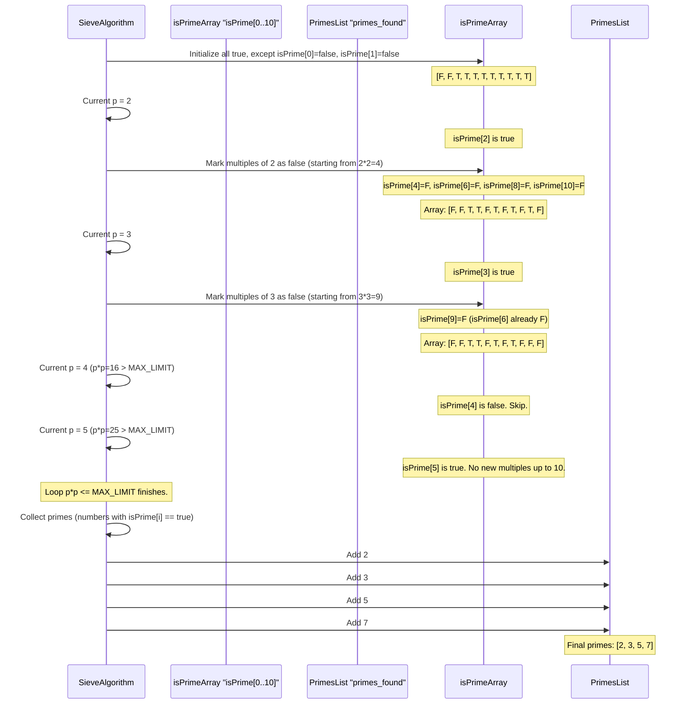

The C++ files like `Level_03/02_Seive/Printing_some_primes.cpp` and others in `Level_03` use this very principle. For instance, `Printing_some_primes.cpp` demonstrates how to use `std::bitset` for `isPrime` and populate a `std::vector<int>` called `primes` with the results.

### Simplified C++ Internal Implementation

Let's look at the core structure as seen in `Level_03/02_Seive/Printing_some_primes.cpp`, slightly simplified:

```cpp
// From Level_03/02_Seive/Printing_some_primes.cpp (conceptually simplified)
// #include <bits/stdc++.h> // Often used for convenience, but specific headers are better.
// using namespace std; // Avoid in large projects, but common in competitive programming.

const int N_LIMIT = 1000000; // Let's imagine a larger limit
std::bitset<N_LIMIT + 1> isPrime_internal; // Our sieve array
std::vector<int> primes_collected; // Where we store primes

void basic_sieve_function() {
    isPrime_internal.set(); // Mark all as potentially prime
    isPrime_internal[0] = isPrime_internal[1] = false; // 0 and 1 are not prime

    // Loop through numbers to mark their multiples
    // Start from 2. For efficiency, only need to go up to sqrt(N_LIMIT).
    for (int p = 2; p * p <= N_LIMIT; p++) {
        // If 'p' is still marked true, it's a prime number
        if (isPrime_internal[p]) {
            // Mark all multiples of 'p' as false (not prime)
            // Start marking from p*p, as smaller multiples (like 2p, 3p)
            // would have already been marked by smaller prime factors.
            for (int multiple = p * p; multiple <= N_LIMIT; multiple += p) {
                isPrime_internal[multiple] = false;
            }
        }
    }

    // After the marking process, collect all numbers that are still true
    for (int p = 2; p <= N_LIMIT; p++) {
        if (isPrime_internal[p]) {
            primes_collected.push_back(p);
        }
    }
}

// int main() {
//     basic_sieve_function();
//     // Now 'primes_collected' contains all primes up to N_LIMIT
//     // You can print them or use them for other calculations.
//     return 0;
// }
```
The key parts are the `bitset` (a very compact way to store millions of true/false values) and the nested loops. The outer loop finds a prime, and the inner loop efficiently marks all its multiples as composite.

## Why is the Sieve Efficient?

Let's quickly compare the Sieve with the "check each number individually" method (called trial division):

| Feature          | Trial Division (Check Each Number)                       | Prime Number Sieve (Eratosthenes)                               |
| :--------------- | :------------------------------------------------------- | :-------------------------------------------------------------- |
| **Goal**         | Find if *one* number is prime. Or, many one by one.      | Find *all* primes up to a given limit.                          |
| **Speed (Rough)** | Slow for finding *many* primes.                        | Very fast for finding *many* primes.                            |
| **Approach**     | For each number, repeatedly divide by small numbers.     | Systematically *mark out* multiples of known primes.            |
| **Efficiency Idea** | Each number `N` is checked many times.                 | Each composite number `M` is marked `false` only once, by its smallest prime factor. This avoids redundant checks. |

The Sieve pre-computes all primes up to a limit, which makes it incredibly useful when you have multiple problems that require prime numbers, like finding prime factors, counting divisors, or calculating Euler's Totient function. You can see examples of these applications in `Level_03/03_Prime Factorization/PrimeFactor.cpp`, `Level_03/04_Number of Divisors/NumOfDivisors.cpp`, and `Level_03/07_ Euler Totient Function/EulerPhi.cpp` and related files. While these specific problems might be more advanced, the Sieve is often the crucial first step!

## Conclusion

The Prime Number Sieve, especially the Sieve of Eratosthenes, is a powerful and elegant algorithm for efficiently finding all prime numbers up to a specified limit. Instead of checking each number individually, it uses a clever "filtering" process to mark out composite numbers, leaving only the primes. This pre-computation technique is fundamental in number theory and forms the basis for solving many advanced problems.

You now have a grasp of how to efficiently identify those special building-block numbers! Next, we'll explore another important data structure that helps manage data based on its importance: [Priority Queue](04_priority_queue_.md).

---

# Chapter 4: Priority Queue

Welcome back to our journey through Data Structures and Algorithms! In our [previous chapter on Prime Number Sieve](03_prime_number_sieve_.md), we learned an efficient way to find special numbers called primes. Now, let's explore a different kind of data structure that helps us manage items based on their "importance": the **Priority Queue**.

## What Problem Does a Priority Queue Solve?

Imagine a special line at an event, like a VIP entrance at a concert or an emergency room at a hospital. In these places, it's not about who arrived first. Instead, it's about who has the highest **priority**. Even if someone arrives later, if they are a VIP or have a critical injury, they get to go first.

A **Priority Queue** works exactly like this! It's a collection of items, but unlike a regular waiting line (where the first one in is the first one out) or a stack (where the last one in is the first one out), a Priority Queue always makes sure that the "most important" item is available first.

This is super useful for many situations:
*   **Emergency Room:** Doctors need to see the most severely injured patient immediately, regardless of their arrival time.
*   **Task Scheduling:** A computer's operating system might prioritize urgent tasks over background downloads.
*   **Finding the "Best" Option:** In many algorithms, you repeatedly need to pick the "best" available item from a constantly changing set, like finding the cheapest flight path or the shortest connection in a network.

## The Priority Queue: Core Idea

At its heart, a Priority Queue is a container that holds items, each with an associated "priority." When you want to retrieve an item, the Priority Queue doesn't give you the one that arrived first or last. It always gives you the item with the **highest priority**.

The definition of "highest priority" can be flexible:
*   For an emergency room, a higher "severity score" means higher priority.
*   For a task list, a lower "deadline time" might mean higher priority.
*   For numbers, the largest number might be highest priority (Max-Priority Queue), or the smallest number might be highest priority (Min-Priority Queue).

## Core Priority Queue Operations

Just like our VIP line, there are specific actions you can perform on a Priority Queue:

| Operation       | Description                                                               | Analogy (Emergency Room)                                   |
| :-------------- | :------------------------------------------------------------------------ | :--------------------------------------------------------- |
| **Push / Insert** | Adds a new item with its priority into the queue.                         | A new patient arrives at the emergency room.               |
| **Pop / Extract** | Removes and returns the item with the **highest priority**.              | The doctor takes the most critical patient to be treated.  |
| **Top / Peek**    | Looks at (but doesn't remove) the item with the **highest priority**.    | The nurse checks who is currently the most critical patient. |
| **isEmpty**     | Checks if there are any items in the queue.                               | Checks if there are any patients waiting.                  |

## Using a Priority Queue: Emergency Room Patients

Let's use our emergency room example to see a Priority Queue in action. We'll use numbers to represent patient severity: `5` means critical, `1` means minor. A higher number means higher priority.

Imagine patients arrive:
1.  Patient A (severity: 2) arrives.
2.  Patient B (severity: 5 - critical!) arrives.
3.  Patient C (severity: 3) arrives.
4.  Patient D (severity: 1) arrives.

If a doctor is ready, who do they treat first? Patient B, because they have the highest severity (5), even though Patient A arrived earlier. After Patient B, who's next? Patient C (severity 3). Then Patient A (severity 2), and finally Patient D (severity 1).

### Code Example (Using C++ `std::priority_queue`)

Most programming languages provide a built-in Priority Queue. In C++, we use `std::priority_queue`, which is part of the Standard Template Library (STL). By default, `std::priority_queue` acts as a **Max-Priority Queue** (largest value has the highest priority).

Here's how we might simulate our emergency room with patients:

```cpp
#include <iostream>
#include <queue> // Required for std::priority_queue
#include <string>

int main() {
    // A priority queue to hold patient severity scores (int).
    // By default, it's a Max-Priority Queue.
    std::priority_queue<int> patientQueue;

    // Patients arrive (Push operations)
    std::cout << "Patients arriving..." << std::endl;
    patientQueue.push(2); // Patient A (Severity 2)
    std::cout << "  Added patient with severity 2." << std::endl;
    patientQueue.push(5); // Patient B (Severity 5 - CRITICAL!)
    std::cout << "  Added patient with severity 5." << std::endl;
    patientQueue.push(3); // Patient C (Severity 3)
    std::cout << "  Added patient with severity 3." << std::endl;
    patientQueue.push(1); // Patient D (Severity 1)
    std::cout << "  Added patient with severity 1." << std::endl;

    std::cout << "\nTreating patients (Pop operations):" << std::endl;
    while (!patientQueue.empty()) {
        int currentSeverity = patientQueue.top(); // See highest priority
        patientQueue.pop();                       // Remove highest priority
        std::cout << "  Treated patient with severity: "
                  << currentSeverity << std::endl;
    }
    return 0;
}
```

**Output:**
```
Patients arriving...
  Added patient with severity 2.
  Added patient with severity 5.
  Added patient with severity 3.
  Added patient with severity 1.

Treating patients (Pop operations):
  Treated patient with severity: 5
  Treated patient with severity: 3
  Treated patient with severity: 2
  Treated patient with severity: 1
```
As you can see, even though patient with severity 2 arrived first, the patient with severity 5 was treated first, followed by 3, 2, and 1. The `top()` operation always gives us the highest number, and `pop()` removes it.

### Min-Priority Queue (Smallest Value First)

Sometimes, you need the *smallest* value to have the highest priority. For example, if you're trying to find the two smallest numbers to combine them (a problem seen in `Level_02/Reduce_the_array.cpp`).

To make `std::priority_queue` a **Min-Priority Queue**, you need to provide an extra detail: `std::greater<int>`.

```cpp
#include <iostream>
#include <queue> // For std::priority_queue
#include <vector> // Required for std::priority_queue's internal container
#include <functional> // Required for std::greater

int main() {
    // A Min-Priority Queue: smallest number has highest priority.
    std::priority_queue<int, std::vector<int>, std::greater<int>> minPQueue;

    std::cout << "Adding numbers to Min-Priority Queue..." << std::endl;
    minPQueue.push(10);
    minPQueue.push(3);
    minPQueue.push(7);
    minPQueue.push(1);

    std::cout << "\nNumbers extracted (smallest first):" << std::endl;
    while (!minPQueue.empty()) {
        std::cout << "  " << minPQueue.top() << std::endl;
        minPQueue.pop();
    }
    return 0;
}
```
**Output:**
```
Adding numbers to Min-Priority Queue...

Numbers extracted (smallest first):
  1
  3
  7
  10
```
Notice how `1` (the smallest) came out first! This is super useful in problems like the one in `Level_02/Reduce_the_array.cpp`, where you repeatedly need to combine the two smallest elements. Similarly, `Level_02/Priority_Queue.cpp` shows how to use it with `std::pair` objects, and `Level_02/Monk_And_Champions_League.cpp` and `Level_02/Monk_and_Multiplication.cpp` illustrate other practical uses of max and min priority queues respectively.

## How Priority Queues Work Internally (Under the Hood)

You might be wondering, how does a Priority Queue magically know which item has the highest priority without checking everything every time? The secret is a special data structure called a **Heap**.

Think of a **Heap** like a well-organized family tree, but with a special rule:
*   **Max-Heap:** Every "parent" is always "greater than or equal to" its "children." This means the largest item is always at the very top of the tree.
*   **Min-Heap:** Every "parent" is always "less than or equal to" its "children." This means the smallest item is always at the very top.

This "heap property" is maintained after every `push` (adding an item) and `pop` (removing an item) operation. When you add a new item, it's put in place and then "bubbles up" if its priority is higher than its parent. When you remove the top item, another item takes its place and "sinks down" until the heap property is restored.

Let's visualize a simple Max-Heap:

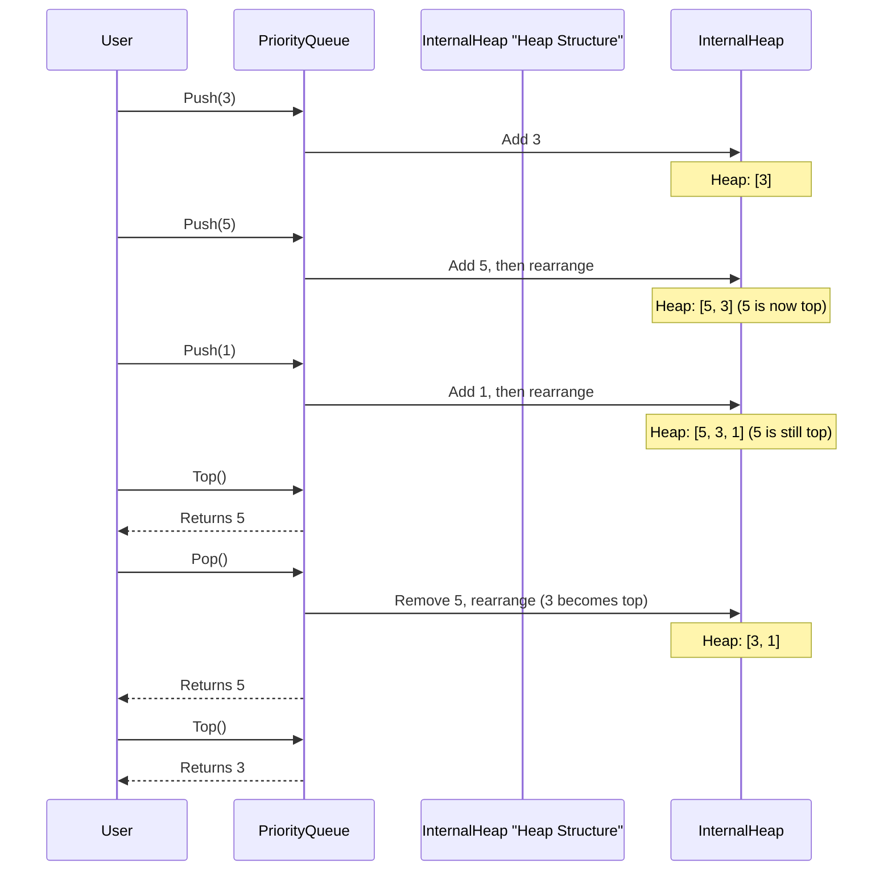

### Simplified C++ Internal Implementation (Conceptual)

In C++, `std::priority_queue` is typically implemented on top of a `std::vector` (or another sequence container) and uses functions that perform these "heap" operations (like `std::make_heap`, `std::push_heap`, `std::pop_heap`) behind the scenes. You don't usually need to write the heap logic yourself when using `std::priority_queue`, but it's good to know that this clever heap structure is what makes it so efficient.

For example, when you `push` an element:
1. The new element is added to the end of the underlying `vector`.
2. Then, it "bubbles up" (swaps with its parent) until its position satisfies the heap property.

When you `pop` an element:
1. The top (highest priority) element is taken out.
2. The last element in the `vector` is moved to the top.
3. This new top element "sinks down" (swaps with its largest child) until its position satisfies the heap property.

This ensures that getting the highest priority item (`top()`) is very fast, and `push()` and `pop()` operations are also quite efficient, even for large numbers of items.

## Why Use a Priority Queue?

| Feature             | Stack (LIFO)              | Queue (FIFO)              | Priority Queue (Priority-based)     |
| :------------------ | :------------------------ | :------------------------ | :---------------------------------- |
| **Order of Access** | Last-In, First-Out        | First-In, First-Out       | Highest Priority First              |
| **Best For**        | Undo/Redo, Browser History | Print Queue, Task Queue   | Emergency Room, Task Scheduling, Algorithms needing "best" item repeatedly |
| **Typical Ops**     | Push, Pop, Top            | Enqueue, Dequeue, Front   | Push, Pop, Top                      |

A Priority Queue is your go-to choice when you consistently need to retrieve the "best" or "most important" item, rather than just the one that arrived earliest or latest.

## More Applications of Priority Queues

Beyond our emergency room example, Priority Queues are crucial in many advanced algorithms:

*   **Graph Algorithms:** They are fundamental to algorithms like **Prim's Algorithm** (for finding the minimum spanning tree, as hinted in `Level_05/Prime Algorithm.cpp`, although that specific file shows a basic implementation without `std::priority_queue`, more advanced versions *do* use it) and **Dijkstra's Algorithm** (for finding the shortest path in a graph), which we will explore in [Shortest Path Algorithms](07_shortest_path_algorithms_.md).
*   **Event Simulation:** Managing events that need to happen at specific times, always processing the earliest event next.
*   **Data Compression:** Algorithms like Huffman coding use priority queues to build optimal codes.
*   **Load Balancing:** Distributing tasks to the least busy server.

## Conclusion

The Priority Queue is a powerful and flexible data structure that allows you to manage collections of items based on their importance, always giving you the highest-priority item first. We learned about its core operations (`push`, `pop`, `top`) and saw how to use C++'s `std::priority_queue` for both max-priority (largest value first) and min-priority (smallest value first) scenarios. We also got a peek under the hood, understanding that it's efficiently implemented using a **Heap** data structure. Priority Queues are essential tools for solving problems where the "best" item needs to be accessed repeatedly.

Ready to explore how we represent connections between things? In our next chapter, we'll dive into [Graph Representation](05_graph_representation_.md).

---

# Chapter 5: Graph Representation

Welcome back to our journey through Data Structures and Algorithms! In our [previous chapter on Priority Queue](04_priority_queue_.md), we learned about organizing data based on its importance, like treating the most critical patient first. Now, let's explore a completely different way to organize and think about data: **Graphs**.

## What Problem Does Graph Representation Solve?

Imagine you have a map, like a subway map, a road map of cities, or even a map of your friends on a social media network. On these maps, you have:

*   **Places/Things:** (e.g., subway stations, cities, people)
*   **Connections:** (e.g., subway lines between stations, roads between cities, friendships between people)

How would a computer store this kind of map? It's not just a simple list or a stack. We need a way to show *who is connected to whom* and *how*. This is exactly what **Graph Representation** helps us do! It's how we store these maps in a computer's memory so we can ask questions like:

*   "Is there a direct road from City A to City B?"
*   "Which cities can I reach directly from City C?"
*   "What are all the people connected to me on this social network?"

In computer science, we call the "places/things" **nodes** (or vertices) and the "connections" **edges**.

## Two Main Ways to Represent a Graph

Just like there are different ways to draw a map (e.g., a simple sketch or a detailed satellite image), there are two main ways to store a graph in a computer:

1.  **Adjacency Matrix** (like a grid/table)
2.  **Adjacency List** (like a list for each node)

Let's dive into each one.

### 1. Adjacency Matrix: The Grid Map

Imagine you have a small map with 3 cities: City 1, City 2, City 3.

An **Adjacency Matrix** is like a big grid or a table. We create a grid where rows and columns represent our cities.

*   If there's a road (edge) between City `i` and City `j`, we put a `1` in the cell where row `i` meets column `j`.
*   If there's no road, we put a `0`.

**Example: A Simple Map**

Let's say we have cities 1, 2, 3.
*   City 1 is connected to City 2.
*   City 2 is connected to City 3.
*   (And because roads usually go both ways, City 2 is connected to City 1, and City 3 is connected to City 2).

Here's how its Adjacency Matrix would look:

| | City 1 | City 2 | City 3 |
| :------- | :----- | :----- | :----- |
| **City 1** | 0 | 1 | 0 |
| **City 2** | 1 | 0 | 1 |
| **City 3** | 0 | 1 | 0 |

Notice that `matrix[1][2]` is 1 (road from 1 to 2) and `matrix[2][1]` is 1 (road from 2 to 1). The diagonal (e.g., `matrix[1][1]`) is usually 0, meaning a city isn't connected to itself.

**How to use it in code (Conceptual C++):**

```cpp
#include <iostream>

const int MAX_CITIES = 5; // Our map can have up to 5 cities
int adjMat[MAX_CITIES][MAX_CITIES]; // A 2D array (our grid)

int main() {
    int numCities = 3; // Let's use 3 cities: 1, 2, 3
    int numRoads = 2;  // Two roads: (1-2), (2-3)

    // Initialize the matrix with all 0s (no roads initially)
    for (int i = 0; i < numCities; ++i) {
        for (int j = 0; j < numCities; ++j) {
            adjMat[i][j] = 0;
        }
    }

    // Add roads (edges)
    // Remember, if city names are 1-based, adjust to 0-based index for arrays
    // For road (1-2) -> adjMat[0][1] and adjMat[1][0]
    adjMat[0][1] = 1; // Road from City 1 to City 2
    adjMat[1][0] = 1; // Road from City 2 to City 1

    adjMat[1][2] = 1; // Road from City 2 to City 3
    adjMat[2][1] = 1; // Road from City 3 to City 2

    // Question: Is there a direct road from City 1 to City 3?
    if (adjMat[0][2] == 1) { // Check adjMat[index for City 1][index for City 3]
        std::cout << "Yes, there is a road." << std::endl;
    } else {
        std::cout << "No, there is no direct road." << std::endl;
    }
    return 0;
}
```
**Output:**
```
No, there is no direct road.
```

The code creates a `MAX_CITIES` by `MAX_CITIES` grid. We initialize it with zeros. Then, for each road, we mark the corresponding cell with a `1`. To check if a road exists, we just look up the value in the grid!
This setup is similar to `Level_04/01_Adjacent matrix , adjacent list/AdjMat.cpp` which takes inputs `n` and `m` and populates a global `adjMat` array.

#### **Pros of Adjacency Matrix:**
*   **Quick Check:** It's super fast to check if a direct connection exists between any two nodes (just look up `adjMat[i][j]`).
*   **Simple:** Easy to understand and implement for smaller graphs.

#### **Cons of Adjacency Matrix:**
*   **Memory Usage:** If you have many cities but very few roads, the matrix will be mostly zeros, wasting a lot of space. For `N` cities, it always uses `N * N` memory, even if `M` (number of roads) is small.
*   **Finding Neighbors:** To find all roads connected to a city, you have to go through its entire row/column, which can be slow if there are many cities.

### 2. Adjacency List: The Address Book Map

Instead of a giant grid, imagine each city has an **address book**. In its address book, a city only lists the names of other cities it has direct roads to.

An **Adjacency List** works just like this. We have a list for *each* node (city), and inside that list, we store all the nodes (cities) that it's directly connected to.

**Example: The Same Simple Map**

Cities 1, 2, 3.
*   City 1 is connected to City 2.
*   City 2 is connected to City 1 and City 3.
*   City 3 is connected to City 2.

Here's how its Adjacency List would look:

*   **City 1:** [2]
*   **City 2:** [1, 3]
*   **City 3:** [2]

**How to use it in code (Conceptual C++):**

```cpp
#include <iostream>
#include <vector> // Required for std::vector

const int MAX_CITIES = 5; // Our map can have up to 5 cities
// An array where each element is a vector (a dynamic list)
std::vector<int> adjList[MAX_CITIES];

int main() {
    int numCities = 3; // Let's use 3 cities: 1, 2, 3
    int numRoads = 2;  // Two roads: (1-2), (2-3)

    // Add roads (edges)
    // For road (1-2) -> add 2 to City 1's list, add 1 to City 2's list
    // If cities are 1-based, adjust indices to 0-based for arrays
    adjList[0].push_back(1); // Add City 2 to City 1's list
    adjList[1].push_back(0); // Add City 1 to City 2's list

    adjList[1].push_back(2); // Add City 3 to City 2's list
    adjList[2].push_back(1); // Add City 2 to City 3's list

    // Question: Which cities are connected to City 2? (index 1)
    std::cout << "Cities connected to City 2 (index 1): ";
    for (int neighbor : adjList[1]) { // Loop through City 2's list
        std::cout << neighbor + 1 << " "; // +1 to print 1-based city names
    }
    std::cout << std::endl;
    return 0;
}
```
**Output:**
```
Cities connected to City 2 (index 1): 1 3 
```
The code uses an array of `std::vector<int>`. Each `adjList[i]` is a vector that stores the indices of cities connected to city `i`. To find all neighbors of a city, we just iterate through its specific vector.
This closely matches `Level_04/01_Adjacent matrix , adjacent list/AdjList.cpp`.

#### **What about Weighted Graphs?**
Sometimes, roads have different "weights" or costs, like distance or travel time.
*   For an **Adjacency Matrix**, instead of `1` or `0`, you'd store the actual weight. `adjMat[i][j] = 10` could mean 10 miles. `0` or a very large number might indicate no connection.
*   For an **Adjacency List**, each entry in a city's list would be a pair: `(neighbor_city, weight)`. For example, `adjList[0]` could contain `(1, 5)` meaning City 0 is connected to City 1 with a weight of 5. This is demonstrated in `Level_04/01_Adjacent matrix , adjacent list/AdjListWeighted.cpp` where `vector<pair<int,int>> adj[mx];` is used.

#### **Pros of Adjacency List:**
*   **Memory Efficient:** For maps with few roads (sparse graphs), it saves a lot of memory because it only stores actual connections.
*   **Finding Neighbors:** It's very efficient to find all neighbors of a specific node; you just access its list.

#### **Cons of Adjacency List:**
*   **Check Connection:** To check if a direct connection exists between two *specific* nodes, you might have to scan through a list, which can be slower than the Adjacency Matrix's direct lookup.

## How Graph Representations Work Internally (Under the Hood)

Both representations use familiar data structures you've already learned about!

### Adjacency Matrix Internal View: A 2D Array

The Adjacency Matrix is directly implemented as a two-dimensional array (or array of arrays). Each cell in this grid is a memory spot.

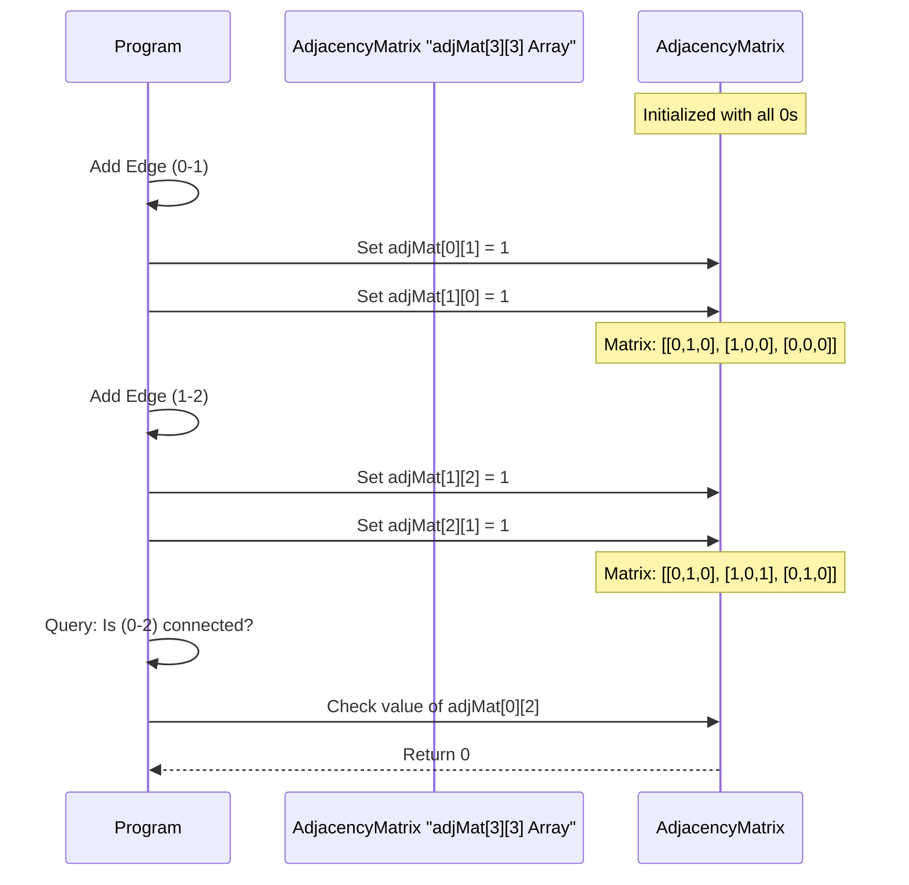
This shows how changes to connections (edges) directly modify the cells in the `adjMat` array.

### Adjacency List Internal View: An Array of Vectors

The Adjacency List is typically an array where each element of the array is a dynamic list (like `std::vector` in C++).

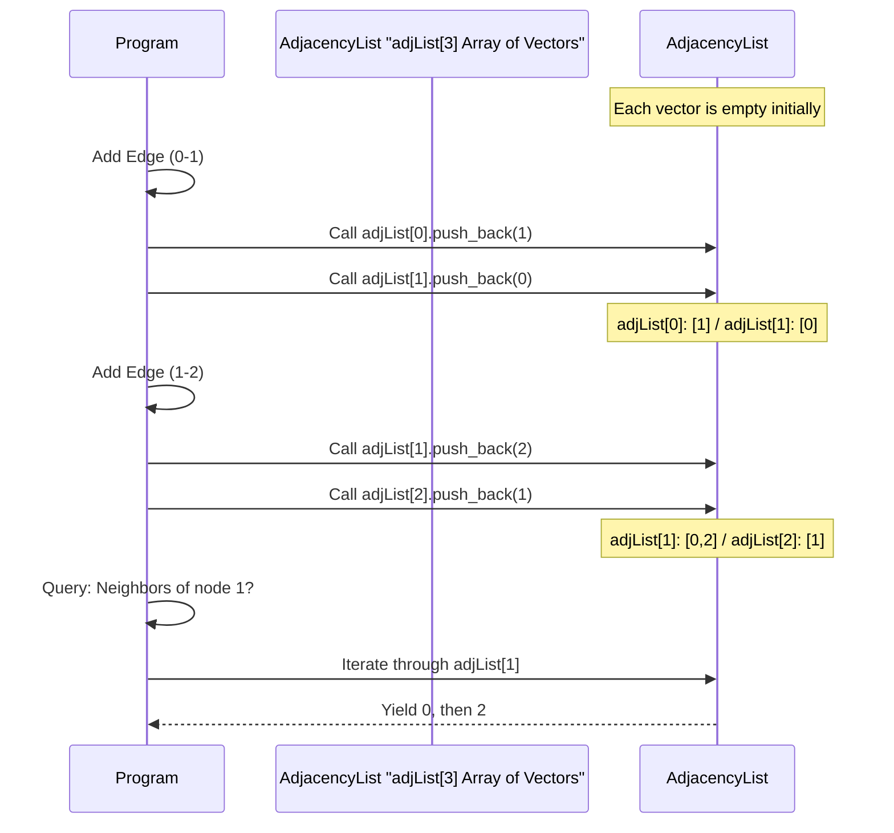
Here, adding an edge means adding elements to the `std::vector` at the correct index in the `adjList` array. When querying neighbors, you simply iterate through that specific vector.

## Adjacency Matrix vs. Adjacency List: A Quick Comparison

| Feature                  | Adjacency Matrix                       | Adjacency List                               |
| :----------------------- | :------------------------------------- | :------------------------------------------- |
| **Storage**              | Fixed size: `N * N`                    | Flexible size: `N + 2 * M` (N nodes, M edges) |
| **Best for**             | Dense graphs (many connections)        | Sparse graphs (few connections)              |
| **Check (u,v) exists**   | Fast: `O(1)` (direct lookup)           | Slower: `O(degree(u))` (scan list)          |
| **Find all neighbors of u** | Slower: `O(N)` (scan row/column)       | Fast: `O(degree(u))` (iterate list)         |
| **Analogy**              | Grid map                               | Address book for each city                   |

*Note: `N` is the number of nodes, `M` is the number of edges. `degree(u)` means the number of connections node `u` has.*

## Conclusion

Graph representation is all about how you store connections between items in a computer. We explored two primary methods: the **Adjacency Matrix**, which uses a grid for fast connection checks, and the **Adjacency List**, which uses lists for each node, saving space and being efficient for finding all a node's neighbors. Each method has its strengths and weaknesses, making one more suitable than the other depending on the specific "map" (graph) you are working with.

Understanding how to represent graphs is the first crucial step. Now that we know how to store these maps, we're ready to learn how to **explore** them! In our next chapter, we'll dive into [Graph Traversal](06_graph_traversal_.md) algorithms.

---

# Chapter 6: Graph Traversal

Welcome back to our exciting journey through Data Structures and Algorithms! In our [previous chapter on Graph Representation](05_graph_representation_.md), we learned how to store maps of "places" and "connections" inside a computer. Now that we know how to represent these maps, how do we actually *explore* them? How do we find our way around?

## What Problem Does Graph Traversal Solve?

Imagine you're lost in a huge, unfamiliar maze, or trying to find all the different rooms in a big castle. You don't want to miss any path, and you want a systematic way to make sure you visit every single reachable corner.

In the world of computers, a **Graph Traversal** algorithm is exactly that: a systematic strategy for visiting every single "place" (node) and "connection" (edge) in a graph. It's like having a plan to explore every part of our digital map.

Why is this important?
*   **Finding paths:** Is there a way from City A to City B?
*   **Discovering connected parts:** Which parts of the network can reach each other?
*   **Locating items:** Find a specific file in a tangled web of folders.
*   **Analyzing social networks:** Who are all my friends, and their friends, and so on?

There are two fundamental strategies for exploring a graph, each with its own way of "moving" through the connections:

1.  **Breadth-First Search (BFS)**
2.  **Depth-First Search (DFS)**

Let's explore them!

## 1. Breadth-First Search (BFS): The "Level by Level" Explorer

Think of BFS like dropping a stone into a pond and watching the ripples spread out. The first ripple hits all immediate neighbors. The second ripple hits their neighbors, and so on. BFS explores a graph **level by level** or **layer by layer**. It visits all the nodes directly connected to the starting node first, then all their unvisited neighbors, and so on.

**Analogy:** Imagine exploring a castle. You visit all rooms directly accessible from your current room. Then, from those new rooms, you visit all *their* new, unvisited rooms, before going deeper into any one branch.

**How it works (Step-by-Step):**

To keep track of which nodes to visit next, and to make sure we visit nodes level by level, BFS uses a **Queue** data structure. (Remember our [Stack Data Structure](01_stack_data_structure_.md) and how a Queue is its opposite: First-In, First-Out?)

Let's explore a simple graph starting from Node 1:

```
Graph:
1 -- 2
|    |
3 -- 4
     |
     5
```

Nodes: 1, 2, 3, 4, 5. Connections: (1,2), (1,3), (2,4), (3,4), (4,5)

1.  **Start at Node 1.** Mark Node 1 as "visited" and add it to a `queue`.
    *   Visited: {1}
    *   Queue: [1]
2.  **Take Node 1 out of the `queue`.** Look at its direct neighbors: 2, 3.
    *   Node 2 is not visited. Mark 2 as "visited", add 2 to `queue`.
    *   Node 3 is not visited. Mark 3 as "visited", add 3 to `queue`.
    *   Visited: {1, 2, 3}
    *   Queue: [2, 3]
3.  **Take Node 2 out of the `queue`.** Look at its direct neighbors: 1, 4.
    *   Node 1 is already visited. Skip.
    *   Node 4 is not visited. Mark 4 as "visited", add 4 to `queue`.
    *   Visited: {1, 2, 3, 4}
    *   Queue: [3, 4]
4.  **Take Node 3 out of the `queue`.** Look at its direct neighbors: 1, 4.
    *   Node 1 is already visited. Skip.
    *   Node 4 is already visited. Skip.
    *   Visited: {1, 2, 3, 4}
    *   Queue: [4]
5.  **Take Node 4 out of the `queue`.** Look at its direct neighbors: 2, 3, 5.
    *   Node 2 is already visited. Skip.
    *   Node 3 is already visited. Skip.
    *   Node 5 is not visited. Mark 5 as "visited", add 5 to `queue`.
    *   Visited: {1, 2, 3, 4, 5}
    *   Queue: [5]
6.  **Take Node 5 out of the `queue`.** No unvisited neighbors.
    *   Visited: {1, 2, 3, 4, 5}
    *   Queue: [] (Empty!)

The BFS order of visiting nodes from 1 is: **1 -> 2 -> 3 -> 4 -> 5**.

### Code Example (Simplified C++ BFS)

This code is a simplified version of what you might find in `Level_04/04_ Breadth First Search/Bfs.cpp`. We'll use an Adjacency List (from [Graph Representation](05_graph_representation_.md)) to store the graph.

```cpp
#include <iostream>
#include <vector>
#include <queue> // For the queue

const int MAX_NODES = 123;
std::vector<int> adj[MAX_NODES]; // Adjacency List for graph
int visited[MAX_NODES];          // To keep track of visited nodes

void bfs(int start_node) {
    visited[start_node] = 1; // Mark start node as visited
    std::queue<int> q;       // Create a queue
    q.push(start_node);      // Add start node to queue

    while (!q.empty()) { // Keep going as long as there are nodes to visit
        int current_node = q.front(); // Get the front node
        q.pop();                      // Remove it from queue
        std::cout << current_node << " "; // "Visit" the node (print it)

        // Explore neighbors of current_node
        for (int neighbor : adj[current_node]) {
            if (visited[neighbor] == 0) { // If neighbor not visited
                visited[neighbor] = 1;    // Mark it visited
                q.push(neighbor);         // Add it to queue
            }
        }
    }
}

int main() {
    // Add graph connections for our example (1-based indexing for clarity)
    // Make sure to adjust for 0-based if using arrays starting at 0
    adj[1].push_back(2); adj[2].push_back(1);
    adj[1].push_back(3); adj[3].push_back(1);
    adj[2].push_back(4); adj[4].push_back(2);
    adj[3].push_back(4); adj[4].push_back(3);
    adj[4].push_back(5); adj[5].push_back(4);

    // Call BFS starting from node 1
    std::cout << "BFS traversal starting from node 1: ";
    bfs(1);
    std::cout << std::endl;
    return 0;
}
```

**Output:**
```
BFS traversal starting from node 1: 1 2 3 4 5 
```

**Explanation:**
*   `adj`: This is our graph, stored as an Adjacency List. `adj[u]` lists all nodes `v` that `u` is connected to.
*   `visited`: This array is crucial. We mark a node as `1` (visited) when we first encounter it and add it to the queue. This prevents us from visiting the same node multiple times and getting stuck in loops.
*   `queue q`: This is the heart of BFS. It stores the nodes we need to visit next, ensuring we process them in the order they were discovered (level by level).

### How BFS Works Internally: The Queue in Action

```mermaid
sequenceDiagram
    participant BFS_Function
    participant VisitedArray "visited[]"
    participant Queue "std::queue"
    participant Graph "adjList"

    Note over VisitedArray: All 0 (unvisited) initially

    BFS_Function->>BFS_Function: Start BFS(1)
    BFS_Function->>VisitedArray: visited[1] = 1
    BFS_Function->>Queue: Push(1)
    Note over Queue: [1]

    loop while Queue is not empty
        BFS_Function->>Queue: Pop() (1)
        Note over Queue: []
        BFS_Function->>BFS_Function: Print 1

        BFS_Function->>Graph: Get neighbors of 1 (2, 3)
        BFS_Function->>VisitedArray: Check visited[2] (0)
        BFS_Function->>VisitedArray: visited[2] = 1
        BFS_Function->>Queue: Push(2)

        BFS_Function->>VisitedArray: Check visited[3] (0)
        BFS_Function->>VisitedArray: visited[3] = 1
        BFS_Function->>Queue: Push(3)
        Note over Queue: [2, 3]

        BFS_Function->>Queue: Pop() (2)
        Note over Queue: [3]
        BFS_Function->>BFS_Function: Print 2

        BFS_Function->>Graph: Get neighbors of 2 (1, 4)
        BFS_Function->>VisitedArray: Check visited[1] (1 - skip)
        BFS_Function->>VisitedArray: Check visited[4] (0)
        BFS_Function->>VisitedArray: visited[4] = 1
        BFS_Function->>Queue: Push(4)
        Note over Queue: [3, 4]
    end
    Note over BFS_Function: ... continues until queue empty ...
```
This diagram shows how `BFS` systematically uses the `queue` to ensure that it explores all nodes at the current "depth" or "level" before moving on to the next deeper level.

## 2. Depth-First Search (DFS): The "Go Deep" Explorer

Think of DFS like exploring a maze by taking one path as far as you can go. If you hit a dead end, you backtrack (go back) and try another path. DFS explores a graph by going as **deep** as possible along each branch before backtracking.

**Analogy:** You're in a library. You pick one shelf, and you go to the very last book on that shelf. If you can't go further, you step back to the previous book, then the previous, until you find a new, unread book to go deep on again.

**How it works (Step-by-Step):**

DFS can be implemented in two main ways: using **recursion** (which uses the computer's built-in call stack) or by explicitly using a **Stack** data structure. Both achieve the "go deep, then backtrack" behavior.

Let's explore the same graph starting from Node 1:

```
Graph:
1 -- 2
|    |
3 -- 4
     |
     5
```

Nodes: 1, 2, 3, 4, 5. Connections: (1,2), (1,3), (2,4), (3,4), (4,5)

1.  **Start at Node 1.** Mark Node 1 as "visited". "Visit" Node 1 (print it).
    *   Visited: {1}
    *   Output: 1
2.  **From Node 1, pick a neighbor (e.g., Node 2).**
    *   Node 2 is not visited. Mark 2 as "visited". "Visit" Node 2.
    *   Visited: {1, 2}
    *   Output: 1 2
3.  **From Node 2, pick a neighbor (e.g., Node 4).**
    *   Node 4 is not visited. Mark 4 as "visited". "Visit" Node 4.
    *   Visited: {1, 2, 4}
    *   Output: 1 2 4
4.  **From Node 4, pick a neighbor (e.g., Node 5).**
    *   Node 5 is not visited. Mark 5 as "visited". "Visit" Node 5.
    *   Visited: {1, 2, 4, 5}
    *   Output: 1 2 4 5
5.  **From Node 5, no unvisited neighbors.** Backtrack to Node 4.
6.  **From Node 4, check other neighbors (2, 3).**
    *   Node 2 is visited. Skip.
    *   Node 3 is not visited. Mark 3 as "visited". "Visit" Node 3.
    *   Visited: {1, 2, 3, 4, 5}
    *   Output: 1 2 4 5 3
7.  **From Node 3, check neighbors (1, 4).** Both are visited. Backtrack to Node 4.
8.  **From Node 4, all neighbors processed.** Backtrack to Node 2.
9.  **From Node 2, all neighbors processed.** Backtrack to Node 1.
10. **From Node 1, check other neighbors (3).** Node 3 is visited. All neighbors processed.

The DFS order of visiting nodes from 1 (depends on neighbor order): **1 -> 2 -> 4 -> 5 -> 3** (or 1 -> 3 -> 4 -> 2 -> 5, etc.)

### Code Example (Simplified C++ Recursive DFS)

This is a simplified version of `Level_04/02_Graph Traversal Using DFS/Dfs_Recursion.cpp`. DFS is often elegantly written using recursion.

```cpp
#include <iostream>
#include <vector>

const int MAX_NODES = 123;
std::vector<int> adj[MAX_NODES]; // Adjacency List for graph
bool is_visited[MAX_NODES];      // To keep track of visited nodes

void dfs_recursive(int current_node) {
    is_visited[current_node] = true; // Mark current node as visited
    std::cout << current_node << " "; // "Visit" the node (print it)

    // Explore neighbors of current_node
    for (int neighbor : adj[current_node]) {
        if (!is_visited[neighbor]) { // If neighbor not visited
            dfs_recursive(neighbor); // Go deeper (recursive call)
        }
    }
}

int main() {
    // Graph connections (1-based indexing for clarity)
    adj[1].push_back(2); adj[2].push_back(1);
    adj[1].push_back(3); adj[3].push_back(1);
    adj[2].push_back(4); adj[4].push_back(2);
    adj[3].push_back(4); adj[4].push_back(3);
    adj[4].push_back(5); adj[5].push_back(4);

    // Call DFS starting from node 1
    std::cout << "DFS traversal starting from node 1: ";
    dfs_recursive(1);
    std::cout << std::endl;
    return 0;
}
```
**Output:**
```
DFS traversal starting from node 1: 1 2 4 5 3 
```

**Explanation:**
*   The `dfs_recursive` function calls itself for each unvisited neighbor. This is the "go deeper" part. When a path runs out of unvisited neighbors, the function calls "return", which automatically handles the "backtracking" to the previous node in the path.

### Code Example (Simplified C++ Iterative DFS with Stack)

You can also implement DFS using an explicit `std::stack` (as hinted in `Level_04/02_Graph Traversal Using DFS/Dfs_Stack.cpp`). This is useful if recursion depth is a concern.

```cpp
#include <iostream>
#include <vector>
#include <stack> // For the stack

const int MAX_NODES = 123;
std::vector<int> adj[MAX_NODES]; // Adjacency List for graph
int visited_iterative[MAX_NODES]; // To keep track of visited nodes

void dfs_iterative(int start_node) {
    std::stack<int> s;         // Create a stack
    s.push(start_node);        // Add start node to stack
    visited_iterative[start_node] = 1; // Mark as visited

    while (!s.empty()) { // Keep going as long as there are nodes to visit
        int current_node = s.top(); // Get the top node
        s.pop();                    // Remove it from stack
        std::cout << current_node << " "; // "Visit" the node (print it)

        // Explore neighbors of current_node
        // Note: For consistent output with recursive DFS,
        // often neighbors are pushed in reverse order or sorted.
        // For simplicity, we just push as found.
        for (int neighbor : adj[current_node]) {
            if (visited_iterative[neighbor] == 0) { // If neighbor not visited
                visited_iterative[neighbor] = 1;    // Mark it visited
                s.push(neighbor);                   // Add it to stack
            }
        }
    }
}

// Same main function as recursive DFS for graph setup...
int main() {
    // Graph connections (1-based indexing for clarity)
    adj[1].push_back(2); adj[2].push_back(1);
    adj[1].push_back(3); adj[3].push_back(1);
    adj[2].push_back(4); adj[4].push_back(2);
    adj[3].push_back(4); adj[4].push_back(3);
    adj[4].push_back(5); adj[5].push_back(4);

    // Call Iterative DFS starting from node 1
    std::cout << "Iterative DFS traversal starting from node 1: ";
    dfs_iterative(1);
    std::cout << std::endl;
    return 0;
}
```
**Output:**
```
Iterative DFS traversal starting from node 1: 1 3 4 5 2 
```
*Note: The exact output order for iterative DFS can vary based on how neighbors are processed (e.g., if `adj` lists are sorted, or if neighbors are pushed in reverse order). This specific output comes from the order of neighbors in `adj` and pushing them as they appear.*

### How DFS Works Internally: The Stack (or Recursion) in Action

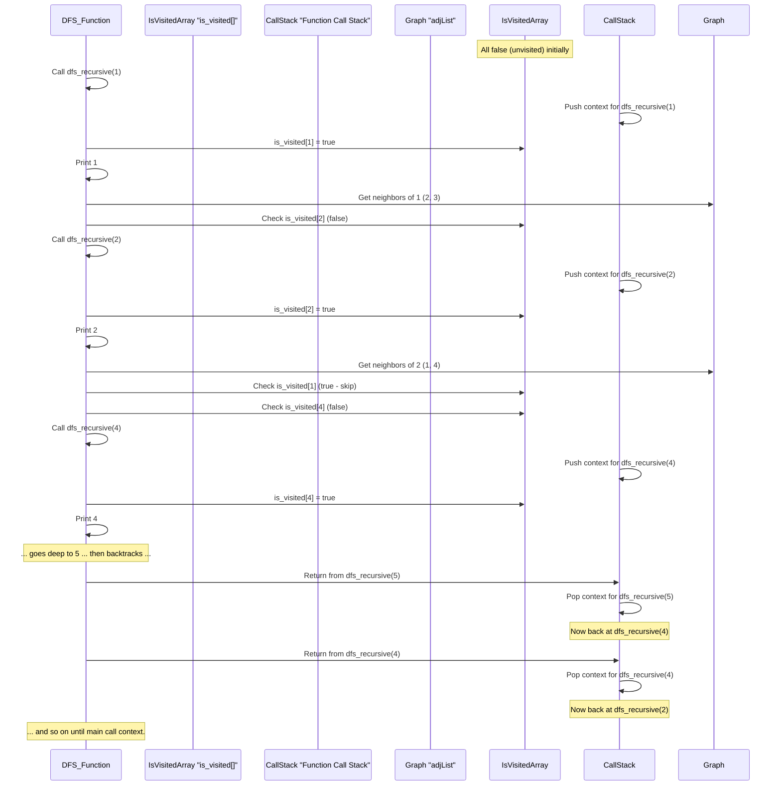
This diagram shows how `DFS` uses the **call stack** (implicitly with recursion, or explicitly with `std::stack`) to keep track of the path it's currently exploring. When it hits a dead end or visited node, it pops from the stack to "backtrack."

## BFS vs. DFS: A Quick Comparison

Both BFS and DFS are powerful for graph traversal, but they explore graphs in different orders and have different strengths:

| Feature          | Breadth-First Search (BFS)                  | Depth-First Search (DFS)                      |
| :--------------- | :------------------------------------------ | :-------------------------------------------- |
| **Order of Visit** | Explores level by level (closest first)     | Explores as deep as possible down one path      |
| **Data Structure** | Queue                                       | Stack (or recursion, which uses a call stack)   |
| **Path Finding** | Finds shortest path in **unweighted** graphs | Useful for any path, but not necessarily shortest |
| **Memory**       | Can use more memory if graph is "wide" (many neighbors) | Can use more memory if graph is "deep" (long paths) |
| **Use Cases**    | Finding shortest path, web crawlers, "all neighbors at distance N" | Detecting cycles, topological sorting, finding connected components |

You can see examples of BFS being used to calculate shortest paths (in unweighted graphs) and levels in files like `Level_04/05_ Shortest path using BFS and Lavel calculation/We_Ship_Cheap.cpp` and `Level_04/04_ Breadth First Search/Monk_and_the_Islands.cpp`. DFS is used for finding connected components as seen in `Level_04/03_Finding connected components of graph (bi-coloring)/Connected_Components_in_a_Graph.cpp` and for problems on grid-like graphs like `Level_04/04_ Breadth First Search/Guilty_Prince.cpp`. Both are fundamental!

## Conclusion

Graph Traversal algorithms provide systematic ways to explore every part of a graph. We've learned about two primary methods: **Breadth-First Search (BFS)**, which explores level by level using a Queue, and **Depth-First Search (DFS)**, which explores as deep as possible down one path using a Stack (or recursion). Understanding how these algorithms work is crucial for solving a wide range of problems, from finding paths in a maze to analyzing complex networks.

Now that we know how to traverse graphs, we can use these techniques to find the "best" paths! In our next chapter, we'll dive into [Shortest Path Algorithms](07_shortest_path_algorithms_.md).

---

# Chapter 7: Shortest Path Algorithms

Welcome back to our exciting journey through Data Structures and Algorithms! In our [previous chapter on Graph Traversal](06_graph_traversal_.md), we learned how to systematically explore every part of a map (graph) using techniques like BFS and DFS. Now, let's take that a step further: what if we don't just want to *explore* the map, but find the *best* way to get from one place to another?

## What Problem Do Shortest Path Algorithms Solve?

Imagine you're planning a road trip from City A to City B. You don't just want *any* route; you want the *fastest* route, or maybe the one that uses the *least fuel*. What if some roads have tolls (costs), or some are faster (lower time cost)?

This is where **Shortest Path Algorithms** come in! These are powerful techniques used in computer science to calculate the most efficient way to travel between two points in a graph. The "efficiency" is usually measured by "cost" or "weight" associated with each connection (road). This "cost" could be:
*   **Distance:** The shortest physical distance.
*   **Time:** The fastest travel time.
*   **Cost:** The cheapest path (e.g., minimum toll fees, or minimum fuel consumption).

These algorithms are super important for:
*   **GPS Navigation:** Finding the quickest route on your phone's map.
*   **Network Routing:** How data packets find the fastest way through the internet.
*   **Logistics:** Optimizing delivery routes for trucks.
*   **Game AI:** How characters find their way around a game world.

In this chapter, we'll look at three famous Shortest Path Algorithms: **Dijkstra's Algorithm**, **Bellman-Ford Algorithm**, and **Floyd-Warshall Algorithm**. Each has its own strengths, depending on the kind of "costs" (weights) in your map and what kind of paths you want to find.

## Weighted Graphs: Adding "Cost" to Connections

Before we dive into the algorithms, let's remember that roads (edges) in our map (graph) can have **weights** or **costs**. In [Graph Representation](05_graph_representation_.md), we briefly mentioned weighted graphs. For example, a connection from City A to City B might have a weight of `10` (meaning 10 miles, 10 minutes, or 10 dollars).

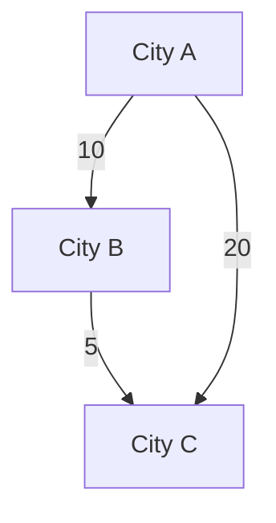
In this simple map:
*   Going A to B costs 10.
*   Going B to C costs 5.
*   Going A to C directly costs 20.

The "shortest path" from A to C is actually A -> B -> C, with a total cost of 10 + 5 = 15, which is cheaper than the direct path of 20. Shortest path algorithms figure this out!

## 1. Dijkstra's Algorithm: The Positive-Weight Pathfinder

Dijkstra's Algorithm (pronounced "Dike-stra") is like a smart GPS that finds the cheapest or fastest way from *one starting point* to *all other reachable places* on your map, but it works only if all the "costs" (weights) on the roads are **positive** (no free rides or getting paid to travel!).

**Problem Solved:** Shortest path from a single source node to all other nodes in a graph with non-negative edge weights.

**Analogy:** You want to find the cheapest flights from *your city* to *every other city* in the country. Dijkstra's will help you, as long as flight prices are always positive (you don't get paid to fly!).

**How it Works (Step-by-Step Idea):**

Dijkstra's is a "greedy" algorithm. It works by building up the shortest path to nodes step by step. It always picks the unvisited city that currently has the *shortest known travel time* from your starting city.

1.  **Preparation:**
    *   Keep track of the "shortest distance found so far" to every city from your starting city. Let's call this `distance[]`. Initially, `distance[start_city]` is 0, and `distance` for all other cities is "infinity" (meaning we don't know how to get there yet).
    *   Keep track of which cities we've already **finalized** the shortest path for. Let's call this `visited[]`. Initially, all are unvisited.
2.  **Repetition:** Repeat `V-1` times (where `V` is the number of cities):
    *   **Pick the "Closest":** Find the unvisited city `u` that has the smallest value in `distance[]`. This is the city we will "visit" next.
    *   **Mark as Visited:** Mark city `u` as `visited`. Its `distance[u]` is now finalized as the shortest path from the start.
    *   **Update Neighbors:** For every neighbor `v` of `u`:
        *   If `v` is not `visited` and a path through `u` to `v` (`distance[u] + weight(u,v)`) is shorter than `distance[v]`, then update `distance[v]` to this new shorter value. This step is called "relaxation".

The `findMinDistence` function (in the code example below) is what helps pick the "Closest" node efficiently. For larger graphs, a [Priority Queue](04_priority_queue_.md) is used to speed up this picking process, as it always keeps the smallest element at the top!

```mermaid
sequenceDiagram
    participant DijkstraAlgo
    participant DistanceArray "distance[]"
    participant VisitedArray "visited[]"

    Note over DistanceArray,VisitedArray: Initial state: distance[0]=0, others INF; all unvisited

    DijkstraAlgo->>DijkstraAlgo: Loop V-1 times
    DijkstraAlgo->>DistanceArray: Find unvisited node 'u' with min distance
    Note over DistanceArray: (Example: u=0, dist[0]=0)

    DijkstraAlgo->>VisitedArray: Mark visited[u] = true
    Note over VisitedArray: visited[0]=true

    DijkstraAlgo->>DistanceArray: For each neighbor 'v' of 'u':
    Note over DijkstraAlgo: (Example: For u=0, neighbors 1, 2)
    DijkstraAlgo->>DistanceArray: If distance[u] + weight(u,v) < distance[v]
    DijkstraAlgo->>DistanceArray: Update distance[v]
    Note over DistanceArray: (Example: dist[1] = min(INF, 0+2)=2; dist[2]=min(INF, 0+4)=4)

    DijkstraAlgo->>DijkstraAlgo: Repeat: Pick next unvisited min (Example: u=1, dist[1]=2)
    DijkstraAlgo->>VisitedArray: Mark visited[1] = true
    DijkstraAlgo->>DistanceArray: Update neighbors of 1
    Note over DistanceArray: (Example: dist[2]=min(4, 2+1)=3; dist[3]=min(INF, 2+7)=9)
    Note over DijkstraAlgo: Algorithm continues until all nodes are visited or distances are finalized.
```

### Code Example (Simplified C++ Dijkstra's)

This code is based on `Level_05/Dijkstra Algorithm.cpp`. We use an Adjacency Matrix for the graph for simplicity in this example.

```cpp
#include <iostream>
#include <vector> // For std::vector if using adjacency list, or just for clarity

const int V = 6;    // Number of nodes (cities)
const int INF = 10000000; // Represents infinity (a very large number)

// This function finds the unvisited node with the smallest current distance
int findMinDistanceNode(int distance[], bool visited[]) {
    int min_val = INF;
    int min_index = -1;
    for (int i = 0; i < V; i++) {
        if (!visited[i] && distance[i] <= min_val) {
            min_val = distance[i];
            min_index = i;
        }
    }
    return min_index;
}

void dijkstra(int graph[V][V], int start_node) {
    int distance[V];   // Stores shortest distance from start_node to i
    bool visited[V];   // True if shortest path to node i is finalized

    // Step 1: Initialize distances and visited status
    for (int i = 0; i < V; i++) {
        distance[i] = INF; // All distances are "infinity" initially
        visited[i] = false; // No nodes visited yet
    }
    distance[start_node] = 0; // Distance to start_node itself is 0

    // Step 2: Find shortest path for all nodes
    for (int count = 0; count < V - 1; count++) {
        int u = findMinDistanceNode(distance, visited); // Pick the closest unvisited node

        if (u == -1) break; // No reachable unvisited nodes left

        visited[u] = true; // Mark it as visited (shortest path finalized)

        // Step 3: Update distances of neighbors of u
        for (int v = 0; v < V; v++) {
            // Check if v is not visited, there's an edge from u to v,
            // u is reachable, and path through u is shorter to v
            if (!visited[v] && graph[u][v] != INF && distance[u] != INF &&
                distance[u] + graph[u][v] < distance[v]) {
                distance[v] = distance[u] + graph[u][v]; // Update distance
            }
        }
    }

    // Print the calculated shortest distances
    std::cout << "Shortest distances from node " << start_node << ":" << std::endl;
    for (int i = 0; i < V; i++) {
        if (distance[i] == INF) {
            std::cout << "Node " << i << ": INF" << std::endl;
        } else {
            std::cout << "Node " << i << ": " << distance[i] << std::endl;
        }
    }
}

int main() {
    // Example Graph (Adjacency Matrix) with positive weights
    // INF means no direct connection
    int graph[V][V] = {
        {0, 2, 4, INF, INF, INF},
        {INF, 0, 1, 7, INF, INF},
        {INF, INF, 0, INF, 3, INF},
        {INF, INF, INF, 0, INF, 1},
        {INF, INF, INF, 2, 0, 5},
        {INF, INF, INF, INF, INF, 0}
    };

    dijkstra(graph, 0); // Start from node 0
    return 0;
}
```
**Output:**
```
Shortest distances from node 0:
Node 0: 0
Node 1: 2
Node 2: 3
Node 3: 9
Node 4: 6
Node 5: 10
```
This output tells us the shortest path from node 0 to node 0 is 0, to node 1 is 2, to node 2 is 3 (0->1->2), and so on.

**Why positive weights only?** Dijkstra's "greedy" choice (always picking the smallest current distance) falls apart if there are negative weights. A negative weight could make a path that looked longer suddenly become shorter after passing through a negative edge.

## 2. Bellman-Ford Algorithm: The Negative-Weight Pathfinder (and Cycle Detector)

What if your map has "roads" where the "cost" is negative? This might sound strange, but in some problems (like currency exchange), a "cost" could represent a profit. If there's a "cycle" (a loop) of negative costs, you could theoretically go around that loop infinitely to make infinite profit!

The **Bellman-Ford Algorithm** can handle these **negative edge weights**. It's also special because it can **detect negative cycles** in a graph.

**Problem Solved:** Shortest path from a single source node to all other nodes in a graph that *may have negative edge weights*. It can also detect if a negative cycle is reachable from the source.

**Analogy:** A financial analyst looking for the most profitable sequence of currency exchanges. Some exchanges might yield a "negative cost" (i.e., a profit). If they find a loop where they keep making money, that's a negative cycle.

**How it Works (Step-by-Step Idea):**

Bellman-Ford works differently than Dijkstra's. Instead of picking the "closest" node, it repeatedly tries to relax *all* edges in the graph many times.

1.  **Preparation:**
    *   Initialize `distance[]` to "infinity" for all nodes, except `distance[start_node] = 0`.
2.  **Relaxation Rounds:** Repeat `V - 1` times (where `V` is the number of nodes):
    *   For *every* edge (u, v) with weight `w` in the graph:
        *   If `distance[u] + w` is less than `distance[v]`, then update `distance[v] = distance[u] + w`.
    *   *(Each round ensures that paths with one more edge are correctly considered.)*
3.  **Negative Cycle Check:** After `V - 1` rounds, run one more relaxation round (the V-th round).
    *   If any distance `distance[v]` *still* changes during this `V`-th round, it means there's a **negative cycle** reachable from the source, because a path can keep getting shorter.

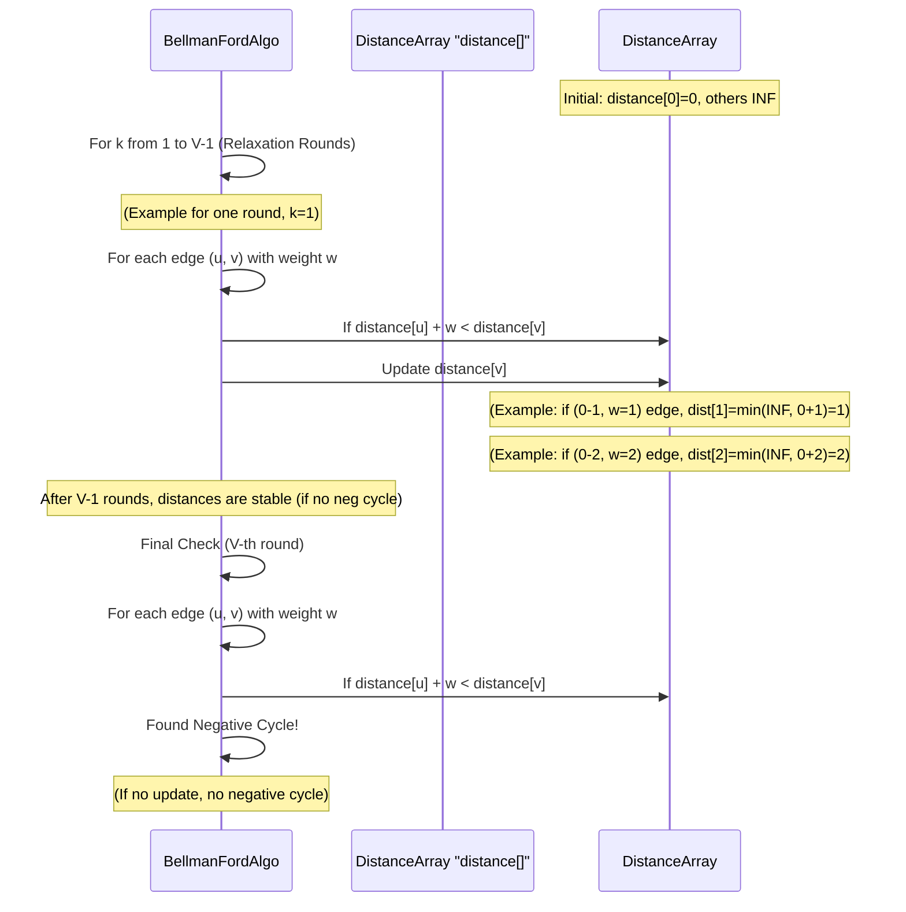

### Code Example (Simplified C++ Bellman-Ford)

This code is based on `Level_05/Bellman Ford Algorithm.cpp` and `Level_05/Bellman Ford Algorithm (Negative Cycle).cpp`. We assume graph is given as an adjacency matrix for simplicity.

```cpp
#include <iostream>
#include <vector>

const int V_BF = 4; // Number of nodes (cities) for Bellman-Ford example
const int INF_BF = 10000000; // Represents infinity

void bellmanFord(int graph[V_BF][V_BF], int start_node) {
    std::vector<int> distance(V_BF, INF_BF); // Dynamic array for distances

    distance[start_node] = 0; // Distance to start_node itself is 0

    // Step 1: Relax all edges V-1 times
    for (int k = 0; k < V_BF - 1; k++) { // V-1 iterations
        for (int u = 0; u < V_BF; u++) { // For each source node u
            for (int v = 0; v < V_BF; v++) { // For each destination node v
                if (graph[u][v] != INF_BF) { // If there's an edge from u to v
                    // Relaxation step
                    if (distance[u] != INF_BF && distance[u] + graph[u][v] < distance[v]) {
                        distance[v] = distance[u] + graph[u][v];
                    }
                }
            }
        }
    }

    // Step 2: Check for negative cycles
    bool hasNegativeCycle = false;
    for (int u = 0; u < V_BF; u++) {
        for (int v = 0; v < V_BF; v++) {
            if (graph[u][v] != INF_BF) {
                if (distance[u] != INF_BF && distance[u] + graph[u][v] < distance[v]) {
                    hasNegativeCycle = true;
                    break; // Found a negative cycle
                }
            }
        }
        if (hasNegativeCycle) break;
    }

    if (hasNegativeCycle) {
        std::cout << "Graph contains a negative-weight cycle!" << std::endl;
    } else {
        std::cout << "Shortest distances from node " << start_node << " (Bellman-Ford):" << std::endl;
        for (int i = 0; i < V_BF; i++) {
            if (distance[i] == INF_BF) {
                std::cout << "Node " << i << ": INF" << std::endl;
            } else {
                std::cout << "Node " << i << ": " << distance[i] << std::endl;
            }
        }
    }
}

int main() {
    // Example Graph with negative weights and a negative cycle
    // A -> B (1), B -> C (-1), C -> D (-1), D -> A (-1)
    // This forms a negative cycle (1 + (-1) + (-1) + (-1) = -2)
    int graph_with_neg_cycle[V_BF][V_BF] = {
        {0, 1, INF_BF, INF_BF},
        {INF_BF, 0, -1, INF_BF},
        {INF_BF, INF_BF, 0, -1},
        {-1, INF_BF, INF_BF, 0}
    };

    std::cout << "Running Bellman-Ford on graph with negative cycle:" << std::endl;
    bellmanFord(graph_with_neg_cycle, 0); // Start from node 0

    std::cout << "\nRunning Bellman-Ford on graph without negative cycle:" << std::endl;
    int graph_no_neg_cycle[V_BF][V_BF] = {
        {0, 1, INF_BF, INF_BF},
        {INF_BF, 0, -1, INF_BF},
        {INF_BF, INF_BF, 0, 2},
        {INF_BF, INF_BF, INF_BF, 0}
    };
    bellmanFord(graph_no_neg_cycle, 0); // Start from node 0
    return 0;
}
```
**Output (for negative cycle graph):**
```
Running Bellman-Ford on graph with negative cycle:
Graph contains a negative-weight cycle!

Running Bellman-Ford on graph without negative cycle:
Shortest distances from node 0 (Bellman-Ford):
Node 0: 0
Node 1: 1
Node 2: 0
Node 3: 2
```
In the first case, it correctly detects the negative cycle. In the second case (where D->A edge is removed, breaking the cycle), it calculates the shortest paths.

## 3. Floyd-Warshall Algorithm: The "All Pairs" Pathfinder

Sometimes, you don't just want to know the shortest path from *one* starting point; you want to know the shortest path between *every single pair* of cities on your map. This is exactly what the **Floyd-Warshall Algorithm** does!

**Problem Solved:** Shortest path between *all pairs* of nodes in a graph. Can also handle negative edge weights (but not negative cycles).

**Analogy:** A travel agency wants to create a comprehensive table that shows the cheapest travel cost between *any* two cities they operate in. They need to fill out a giant matrix of all possible starting and ending points.

**How it Works (Step-by-Step Idea):**

Floyd-Warshall uses a technique called **Dynamic Programming**. It builds up the solution by considering intermediate nodes.

1.  **Preparation:**
    *   Start with a `distance_matrix[i][j]` that holds the direct distance from node `i` to node `j` (or infinity if no direct edge). `distance_matrix[i][i]` is 0.
2.  **Iteration with Intermediate Nodes:** Use three nested loops:
    *   **Outer loop (k):** Iterate through every possible node `k` in the graph. `k` represents the "intermediate" node, meaning we are trying to see if passing *through* `k` can shorten the path between any two other nodes `i` and `j`.
    *   **Middle loop (i):** Iterate through all possible starting nodes `i`.
    *   **Inner loop (j):** Iterate through all possible ending nodes `j`.
    *   **Update:** For each pair `(i, j)`, check if `distance_matrix[i][k] + distance_matrix[k][j]` is shorter than the current `distance_matrix[i][j]`. If it is, update `distance_matrix[i][j]` with this new shorter path.
        *   `distance_matrix[i][j] = min(distance_matrix[i][j], distance_matrix[i][k] + distance_matrix[k][j])`

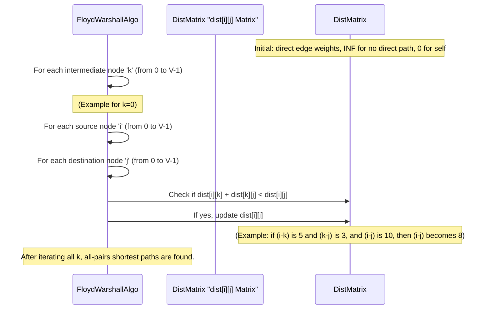

### Code Example (Simplified C++ Floyd-Warshall)

This code is based on `Level_05/Floyd Warshall Algorithm.cpp`.

```cpp
#include <iostream>
#include <vector>
#include <algorithm> // For std::min

const int INF_FW = 10000000; // Represents infinity

void floydWarshall(std::vector<std::vector<int>>& dist, int V_FW) {
    // k is the intermediate node
    for (int k = 0; k < V_FW; k++) {
        // i is the starting node
        for (int i = 0; i < V_FW; i++) {
            // j is the ending node
            for (int j = 0; j < V_FW; j++) {
                // If node k is a valid intermediate node for path from i to j,
                // and passing through k makes the path shorter
                if (dist[i][k] != INF_FW && dist[k][j] != INF_FW &&
                    dist[i][k] + dist[k][j] < dist[i][j]) {
                    dist[i][j] = dist[i][k] + dist[k][j];
                }
            }
        }
    }
}

int main() {
    int V_FW = 5; // Number of bus stops (nodes)

    // Initial graph represented as an adjacency matrix
    // dist[i][j] is the direct time/cost from i to j
    // INF_FW means no direct connection
    std::vector<std::vector<int>> dist_matrix = {
        {0, 5, INF_FW, 10, INF_FW},
        {INF_FW, 0, 3, INF_FW, INF_FW},
        {INF_FW, INF_FW, 0, 1, 2},
        {INF_FW, INF_FW, INF_FW, 0, 4},
        {INF_FW, INF_FW, INF_FW, INF_FW, 0}
    };

    floydWarshall(dist_matrix, V_FW);

    std::cout << "All-Pairs Shortest Paths (Floyd-Warshall):" << std::endl;
    for (int i = 0; i < V_FW; ++i) {
        for (int j = 0; j < V_FW; ++j) {
            if (dist_matrix[i][j] == INF_FW) {
                std::cout << "INF\t";
            } else {
                std::cout << dist_matrix[i][j] << "\t";
            }
        }
        std::cout << std::endl;
    }
    
    // Example query as in the original file
    int bus_stops_src = 0; // Example: Bus stop 1 (index 0)
    int pickup_point_dest = 4; // Example: Pickup point 5 (index 4)
    std::cout << "\nMinimum time from Bus Stop " << bus_stops_src + 1
              << " to Pickup Point " << pickup_point_dest + 1 << " is: "
              << dist_matrix[bus_stops_src][pickup_point_dest] << std::endl;

    return 0;
}
```
**Output:**
```
All-Pairs Shortest Paths (Floyd-Warshall):
0       5       8       9       10      
INF     0       3       4       5       
INF     INF     0       1       2       
INF     INF     INF     0       4       
INF     INF     INF     INF     0       

Minimum time from Bus Stop 1 to Pickup Point 5 is: 10
```
The output matrix shows the shortest path between any two nodes. For example, `dist_matrix[0][4]` is `10`, meaning the shortest path from node 0 to node 4 is 10.

## Comparison of Shortest Path Algorithms

Here's a quick summary of when to use which algorithm:

| Algorithm       | Type of Edge Weights         | What it Finds                  | Best For                                       | Notes                                          |
| :-------------- | :--------------------------- | :----------------------------- | :--------------------------------------------- | :--------------------------------------------- |
| **Dijkstra's**  | **Non-negative** (0 or positive) | Single Source to All Others    | Faster for large graphs with positive weights  | Uses a [Priority Queue](04_priority_queue_.md) for speed. |
| **Bellman-Ford**| **Can handle negative**; detects negative cycles | Single Source to All Others    | When negative weights are present, or need to detect cycles | Slower than Dijkstra's, but more versatile.    |
| **Floyd-Warshall**| **Can handle negative** (but not negative cycles) | All Pairs (shortest path between every `i` and `j`) | When you need all-to-all shortest paths, especially for dense graphs | Uses dynamic programming with 3 nested loops.  |

There are also specialized algorithms for specific types of graphs, like for Multistage Graphs (as seen in `Level_05/multistage_shortest_path.cpp` and `Level_05/multistage_graph_cost.cpp`), but Dijkstra, Bellman-Ford, and Floyd-Warshall are the most fundamental and widely applicable general-purpose shortest path algorithms.

## Conclusion

Shortest Path Algorithms are essential tools in computer science, allowing us to find the most efficient routes in a graph based on edge "costs" or "weights". We explored three key algorithms: **Dijkstra's Algorithm** for single-source shortest paths in graphs with positive weights, **Bellman-Ford Algorithm** which can handle negative weights and detect negative cycles, and **Floyd-Warshall Algorithm** for finding shortest paths between all pairs of nodes. Understanding these algorithms is crucial for solving real-world problems from GPS navigation to network optimization.

This marks the end of our journey through this selection of fundamental Data Structures and Algorithms! You've learned about organizing data (Stacks, Priority Queues), arranging data (Sorting), finding special numbers (Prime Sieve), and navigating complex connections (Graphs, Traversal, Shortest Paths). Keep practicing and exploring, as this is just the beginning of your exciting journey in computer science!

---
