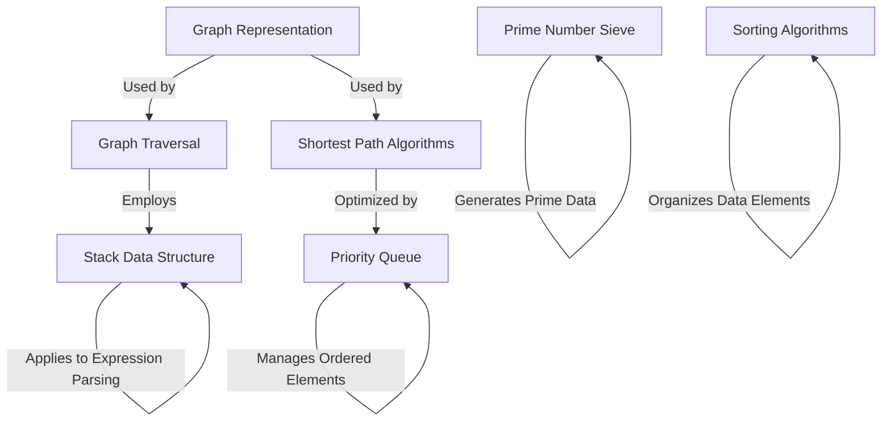

# Tutorial: Data-Structure-and-Algorithm

This project, `Data-Structure-and-Algorithm`, serves as a **comprehensive collection** of fundamental algorithms and data structures. It provides *practical implementations* and *explanations* for common computational problems across various domains like graph theory, sorting, and number theory. It's designed to illustrate how these core concepts are stored and manipulated to solve problems efficiently.

## Visual Overview

## Chapters

1. [Stack Data Structure
](./Tutorial/01_stack_data_structure_.md)
2. [Sorting Algorithms
](./Tutorial/02_sorting_algorithms_.md)
3. [Prime Number Sieve
](./Tutorial/03_prime_number_sieve_.md)
4. [Priority Queue
](./Tutorial/04_priority_queue_.md)
5. [Graph Representation
](./Tutorial/05_graph_representation_.md)
6. [Graph Traversal
](./Tutorial/06_graph_traversal_.md)
7. [Shortest Path Algorithms
](./Tutorial/07_shortest_path_algorithms_.md)

---