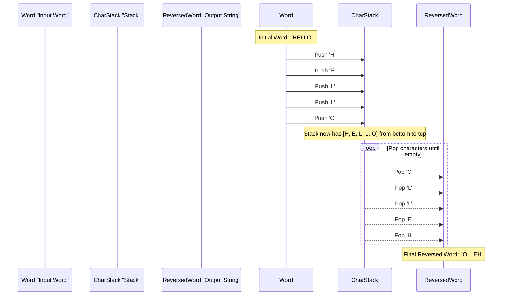
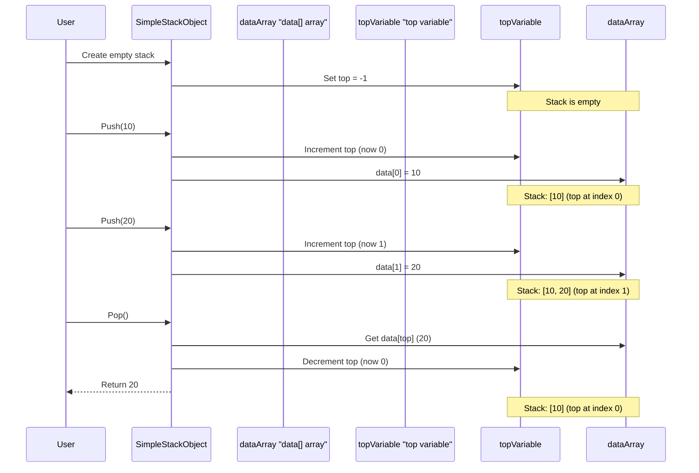

# Chapter 1: Stack Data Structure

Welcome to the exciting world of Data Structures and Algorithms! We're starting our journey with a fundamental concept: the **Stack Data Structure**. Don't worry if these terms sound intimidating; we'll break them down step by step, using simple analogies and practical examples.

## What Problem Does a Stack Solve?

Imagine you're browsing the internet. You click on a link, then another, then another. If you want to go back to a previous page, you simply click the "back" button, and you magically return to the page you just left. How does your browser remember the order of pages you visited? Or, think about your favorite text editor. When you make a mistake, you hit "undo," and the last change you made disappears. How does the editor know which action was the *last* one to undo?

These are perfect examples of where a **Stack** comes in handy! A stack is a simple yet powerful way to manage data, especially when you need to keep track of things in a specific order: the last thing you added is the first thing you need to access.

## The Stack: A Real-World Analogy

The best way to understand a stack is to think of a **stack of plates** in a kitchen cabinet:

*   **Adding a plate:** You can only put a new plate on **top** of the existing stack.
*   **Removing a plate:** You can only take the plate from the **top** of the stack. You wouldn't pull a plate from the middle or bottom, right?

This "last-in, first-out" behavior is the core principle of a Stack. We call it **LIFO**. The plate you put *last* on the stack is the *first* one you take off.

## Core Stack Operations

Just like with our plate stack, there are specific actions you can perform on a data stack:

| Operation | Description                                                                         | Analogy (Plates)              |
| :-------- | :---------------------------------------------------------------------------------- | :---------------------------- |
| **Push**  | Adds a new item to the very **top** of the stack.                                   | Putting a new plate on top.   |
| **Pop**   | Removes and returns the item from the very **top** of the stack.                    | Taking the topmost plate away. |
| **Top**   | Looks at (but doesn't remove) the item currently at the **top** of the stack.       | Peeking at the top plate.     |
| **isEmpty** | Checks if the stack has any items in it.                                            | Checking if there are any plates left. |
| **isFull**  | Checks if the stack has reached its maximum capacity (if it has one).               | Checking if the cabinet is full of plates. |

## Using a Stack: Reversing a Word

Let's try to solve a simple problem using a stack: **reversing a word**. For example, turning "HELLO" into "OLLEH".

Here's how we can do it with a stack:

1.  **Push** each letter of the word "HELLO" onto the stack, one by one.
2.  Once all letters are pushed, **Pop** them out one by one. Because of the LIFO rule, the last letter pushed ("O") will be the first one popped, then "L", and so on.

Let's trace this with "HELLO":



### Code Example (Using C++ `std::stack`)

Most programming languages provide a built-in stack feature. In C++, we can use `std::stack`, which is part of the Standard Template Library (STL). It simplifies things a lot!

Here's a very simple C++ example for reversing a word:

```cpp
#include <iostream>
#include <stack>   // Required for std::stack
#include <string>

int main() {
    std::string word = "HELLO";
    std::stack<char> charStack; // Create a stack to hold characters

    // Step 1: Push characters onto the stack
    for (char c : word) {
        charStack.push(c); // Add character to the top
    }

    // Step 2: Pop characters to form the reversed word
    std::string reversedWord = "";
    while (!charStack.empty()) { // As long as the stack is not empty
        reversedWord += charStack.top(); // Get the topmost character
        charStack.pop();                 // Remove the topmost character
    }
    std::cout << "Original: " << word << std::endl;
    std::cout << "Reversed: " << reversedWord << std::endl;
    return 0;
}
```

**Output:**
```
Original: HELLO
Reversed: OLLEH
```

As you can see, the `std::stack` makes the `push` and `pop` operations very straightforward. We first push "H", then "E", "L", "L", "O". When we pop, "O" comes out first, then "L", and so on, giving us the reversed word.

Another common use for stacks is checking if parentheses in an expression are balanced (e.g., `({[]})` is balanced, `([)]` is not). This is shown in `Level_02/Balanced_Parenthesis.cpp`, where a `std::stack<char>` is used to match opening and closing brackets.

## How Stacks Work Internally (Under the Hood)

You might be wondering, how is a stack actually built in a computer's memory? Often, stacks are implemented using something called an **array** or a **linked list**. For simplicity, let's think of it as an array (a fixed-size list of storage spots).

Imagine our `SimpleStack` is an array called `data` and a special variable called `top`.

*   `data`: This is where we store the actual items.
*   `top`: This integer variable keeps track of the **index** (position) of the most recently added item in our `data` array. When the stack is empty, `top` is typically set to `-1`.

Let's trace how `push` and `pop` would work with this internal structure:



### Simplified C++ Internal Implementation

The files `Level_01/06_Stack/Stack_Operation.cpp` and `Level_01/06_Stack/Stack_Operation_With_Array.cpp` show basic ways to implement a stack using C++ arrays. Here's a highly simplified version to illustrate the core idea:

```cpp
// From Level_01/06_Stack/Stack_Operation.cpp and Stack_Operation_With_Array.cpp
#define MAX_SIZE 5 // Our small stack can hold 5 items

struct MySimpleStack {
    int top;         // Index of the top element
    int data[MAX_SIZE]; // The array to store items
};

// Function to add an item (Push operation)
void myPush(MySimpleStack* s, int item) {
    // Check if the stack is full
    if (s->top < MAX_SIZE - 1) { // If top is not at the last index
        s->top++;                // Move top up
        s->data[s->top] = item;  // Place item at new top
    }
    // Else: stack is full (overflow)
}

// Function to remove an item (Pop operation)
int myPop(MySimpleStack* s) {
    // Check if the stack is empty
    if (s->top != -1) { // If top is not -1 (empty)
        int item = s->data[s->top]; // Get item from top
        s->top--;                   // Move top down
        return item;
    }
    return -1; // Indicate stack was empty (underflow)
}
```

In this code:
*   `MySimpleStack` holds our `data` array and the `top` index.
*   `myPush` increments `top` first, then stores the new `item`.
*   `myPop` retrieves the `item` from `top`, then decrements `top`.
*   Checks like `s->top < MAX_SIZE - 1` (for `myPush`) and `s->top != -1` (for `myPop`) are essential to prevent errors like trying to add to a full stack (overflow) or remove from an empty stack (underflow). You can see these checks implemented in `Level_01/06_Stack/stack_implementing.cpp` and `Level_01/06_Stack/Stack_Operation_With_Array.cpp`.

## More Applications of Stacks

Beyond reversing words and browser history, stacks are used in many other areas:

*   **Function Calls:** When you write a program and one function calls another, the computer uses a stack to keep track of where to return after each function finishes.
*   **Expression Evaluation:** Stacks are crucial for converting and evaluating mathematical expressions (like converting "2 + 3" to a form easier for computers to process).
*   **Undo/Redo Features:** As mentioned, stacks power the undo/redo functionality in many applications.
*   **Depth-First Search (DFS):** An important algorithm for exploring graphs (which we'll cover later in [Graph Traversal](06_graph_traversal_.md)) often uses a stack to manage its exploration path. You can see an example of this in `Level_04/02_Graph Traversal Using DFS/Dfs_Stack.cpp`.

## Conclusion

The Stack Data Structure is a foundational concept in computer science. It's a simple, linear data structure that follows the **Last-In, First-Out (LIFO)** principle, just like a stack of plates. We learned about its core operations: `push` (add), `pop` (remove), `top` (peek), `isEmpty`, and `isFull`. We also saw how it can be used to solve practical problems like reversing a word and understood its basic internal implementation using an array. Stacks are incredibly versatile and form the basis for many more complex algorithms and systems.

Ready to explore another fundamental concept? In our next chapter, we'll dive into different ways to organize data efficiently with [Sorting Algorithms](02_sorting_algorithms_.md).

---