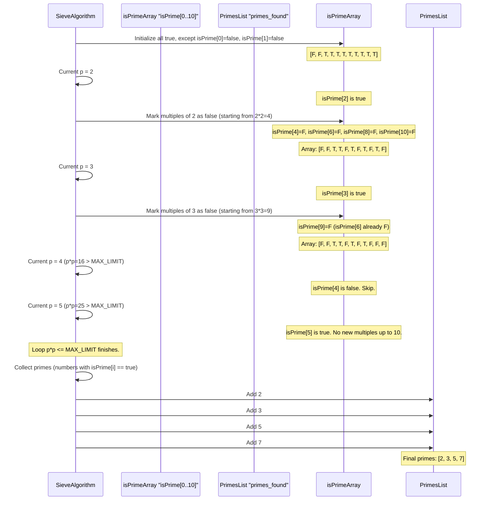

# Chapter 3: Prime Number Sieve

Welcome back to our exciting journey through Data Structures and Algorithms! In our [previous chapter on Sorting Algorithms](02_sorting_algorithms_.md), we explored different ways to arrange data in a specific order, like putting books on a shelf alphabetically. Now, let's switch gears and dive into a special technique for finding particular types of numbers: the **Prime Number Sieve**.

## What Problem Does a Prime Number Sieve Solve?

Imagine you're a detective, and your mission is to find all the "special" numbers up to a certain limit – say, up to 100. These special numbers are called **prime numbers**.

**What is a Prime Number?**
A prime number is a whole number greater than 1 that has only two distinct positive divisors: 1 and itself.
*   Examples: 2, 3, 5, 7, 11, 13, 17, 19, 23...
*   Non-examples (these are called composite numbers): 4 (divisible by 1, 2, 4), 6 (divisible by 1, 2, 3, 6), 9 (divisible by 1, 3, 9).

Why do we care about prime numbers? They are like the building blocks of all other whole numbers. They are used in cryptography (securing online communication), number theory problems, and many other areas of computer science and mathematics.

Now, if you want to find out if a *single* number, say 97, is prime, you can try dividing it by all numbers from 2 up to its square root. If none of them divide it perfectly, it's prime. But what if you need to find *all* prime numbers up to a very large number, like 1,000,000? Checking each number one by one would be incredibly slow!

This is where the **Prime Number Sieve** comes to the rescue! It's a super-efficient method to find all prime numbers up to a certain limit all at once, much faster than checking each number individually. Think of it as a clever way to filter out all the non-prime numbers.

## The Sieve: A Real-World Analogy

The best way to understand a Sieve is to think of a **kitchen sieve** (like a colander) or a **filter**.

Imagine you have a big bowl of mixed pasta and rice, and you only want the rice. You pour the mixture into a sieve. The small rice grains fall through, while the larger pasta pieces are left behind.

The Prime Number Sieve works similarly:

1.  You start with a "list" of all numbers up to your limit, assuming they are *all* potentially prime (like having all pasta and rice in the bowl).
2.  Then, you systematically remove (or "filter out") all the numbers that are *not* prime.
3.  What's left in your "sieve" are only the prime numbers.

The most famous and common algorithm for this is called the **Sieve of Eratosthenes** (pronounced "era-tos-theen-ees").

## How the Sieve of Eratosthenes Works (Step-by-Step)

Let's find all prime numbers up to 10 using the Sieve of Eratosthenes.

We'll start with a list of numbers from 2 to 10, initially assuming all are prime:

Numbers: `[2, 3, 4, 5, 6, 7, 8, 9, 10]`
Status: `[P, P, P, P, P, P, P, P, P]` (P = Potentially Prime)

1.  **Start with the first prime number: 2.**
    *   `2` is prime. So, keep `2`.
    *   Now, mark all multiples of `2` as **not prime (composite)**.
        *   `4` (2x2) is not prime.
        *   `6` (2x3) is not prime.
        *   `8` (2x4) is not prime.
        *   `10` (2x5) is not prime.
    Numbers: `[2, 3, N, 5, N, 7, N, 9, N]` (N = Not Prime)

2.  **Move to the next unmarked number: 3.**
    *   `3` is still marked as prime. So, `3` is prime. Keep `3`.
    *   Now, mark all multiples of `3` as **not prime**.
        *   `6` (3x2) is already marked.
        *   `9` (3x3) is not prime.
    Numbers: `[2, 3, N, 5, N, 7, N, N, N]`

3.  **Move to the next unmarked number: 4.**
    *   `4` is already marked as not prime. Skip it.

4.  **Move to the next unmarked number: 5.**
    *   `5` is still marked as prime. So, `5` is prime. Keep `5`.
    *   Now, mark all multiples of `5` as **not prime**.
        *   `10` (5x2) is already marked.
    Numbers: `[2, 3, N, 5, N, 7, N, N, N]`

5.  **Move to the next unmarked number: 6.**
    *   `6` is already marked as not prime. Skip it.

6.  **Move to the next unmarked number: 7.**
    *   `7` is still marked as prime. So, `7` is prime. Keep `7`.
    *   When we mark multiples, we only need to start from `p * p` (7 * 7 = 49). Since 49 is greater than our limit (10), there are no multiples of 7 (other than 7 itself) within our list that haven't already been marked by smaller primes (like 2, 3, 5). So, we stop here for 7.

We continue this process until we've checked numbers up to the square root of our limit. For 10, `sqrt(10)` is about 3.16. So, we only needed to check up to 3.

**The numbers that are still marked "P" are our prime numbers: 2, 3, 5, 7.**

## Implementing the Sieve

In programming, we usually use a large array (or a `std::bitset` in C++, which is like a super-efficient array of `true`/`false` values) to keep track of which numbers are prime.

*   `isPrime[i] = true` means "i is currently considered prime."
*   `isPrime[i] = false` means "i is not prime (it's composite)."

Here's a simplified C++ example that implements the Sieve algorithm. This is a common pattern you'll see in problems like those found in `Level_03` of the project, such as `Level_03/02_Seive/Printing_some_primes.cpp`.

```cpp
#include <iostream>  // For input/output
#include <vector>    // To store the found prime numbers
#include <bitset>    // For efficient true/false array (isPrime)

// Define the maximum number we want to find primes up to
const int MAX_LIMIT = 30; // Let's find primes up to 30 for this example

// A global bitset to store whether a number is prime or not.
// MAX_LIMIT + 1 because we need indices from 0 to MAX_LIMIT.
std::bitset<MAX_LIMIT + 1> isPrime;

// A global vector to store the actual prime numbers we find.
std::vector<int> primes_found;

void sieve_algorithm() {
    // Step 1: Assume all numbers from 0 to MAX_LIMIT are prime initially.
    isPrime.set(); // This sets all values in the bitset to 'true'

    // Step 2: 0 and 1 are not prime. Mark them as false.
    isPrime[0] = false;
    isPrime[1] = false;

    // Step 3: Loop through numbers starting from 2 up to sqrt(MAX_LIMIT).
    // 'p' is our current potential prime number.
    for (int p = 2; p * p <= MAX_LIMIT; p++) {
        // If isPrime[p] is still true, it means 'p' is a prime number.
        if (isPrime[p]) {
            // Step 4: Mark all multiples of 'p' as not prime.
            // We start marking from p*p because smaller multiples (like 2*p, 3*p)
            // would have already been marked by smaller prime factors.
            for (int multiple = p * p; multiple <= MAX_LIMIT; multiple += p) {
                isPrime[multiple] = false; // Mark as composite
            }
        }
    }

    // Step 5: After marking, collect all numbers that are still true in isPrime.
    for (int p = 2; p <= MAX_LIMIT; p++) {
        if (isPrime[p]) {
            primes_found.push_back(p); // Add to our list of primes
        }
    }
}

int main() {
    sieve_algorithm(); // Run the sieve to find primes

    std::cout << "Prime numbers up to " << MAX_LIMIT << " are:" << std::endl;
    // Print out the primes we found
    for (int prime : primes_found) {
        std::cout << prime << " ";
    }
    std::cout << std::endl;

    return 0;
}
```

**Output:**
```
Prime numbers up to 30 are:
2 3 5 7 11 13 17 19 23 29
```

**Explanation of the code:**
*   `MAX_LIMIT`: This defines how far we want to find prime numbers.
*   `isPrime`: This is our "filter" array. `isPrime[i]` is `true` if `i` is prime, `false` otherwise. `std::bitset` is a very memory-efficient way to store many `true`/`false` values.
*   `primes_found`: This `std::vector` will store the actual prime numbers we discover.
*   `isPrime.set()`: Initializes all entries in `isPrime` to `true`.
*   `isPrime[0] = false; isPrime[1] = false;`: Numbers 0 and 1 are special cases and are not considered prime.
*   **Outer Loop (`for (int p = 2; ...)`):** This loop iterates through potential prime numbers (`p`).
    *   The condition `p * p <= MAX_LIMIT` is a clever optimization. We only need to check prime factors up to the square root of `MAX_LIMIT`. If a number `N` has a prime factor larger than `sqrt(N)`, it *must* also have a prime factor smaller than `sqrt(N)`, which would have already marked `N` as composite.
*   **Inner Loop (`for (int multiple = p * p; ...)`):** If `p` is confirmed to be a prime, this loop marks all multiples of `p` as `false` (not prime). We start marking from `p * p` for efficiency.
*   **Final Loop:** After all marking is done, we simply loop from 2 to `MAX_LIMIT` and collect all numbers that are still marked `true` in `isPrime`. These are our primes!

## How the Sieve Works Internally (Under the Hood)

Let's trace how the `sieve_algorithm` function works with our `MAX_LIMIT` of 10 for better understanding:



The C++ files like `Level_03/02_Seive/Printing_some_primes.cpp` and others in `Level_03` use this very principle. For instance, `Printing_some_primes.cpp` demonstrates how to use `std::bitset` for `isPrime` and populate a `std::vector<int>` called `primes` with the results.

### Simplified C++ Internal Implementation

Let's look at the core structure as seen in `Level_03/02_Seive/Printing_some_primes.cpp`, slightly simplified:

```cpp
// From Level_03/02_Seive/Printing_some_primes.cpp (conceptually simplified)
// #include <bits/stdc++.h> // Often used for convenience, but specific headers are better.
// using namespace std; // Avoid in large projects, but common in competitive programming.

const int N_LIMIT = 1000000; // Let's imagine a larger limit
std::bitset<N_LIMIT + 1> isPrime_internal; // Our sieve array
std::vector<int> primes_collected; // Where we store primes

void basic_sieve_function() {
    isPrime_internal.set(); // Mark all as potentially prime
    isPrime_internal[0] = isPrime_internal[1] = false; // 0 and 1 are not prime

    // Loop through numbers to mark their multiples
    // Start from 2. For efficiency, only need to go up to sqrt(N_LIMIT).
    for (int p = 2; p * p <= N_LIMIT; p++) {
        // If 'p' is still marked true, it's a prime number
        if (isPrime_internal[p]) {
            // Mark all multiples of 'p' as false (not prime)
            // Start marking from p*p, as smaller multiples (like 2p, 3p)
            // would have already been marked by smaller prime factors.
            for (int multiple = p * p; multiple <= N_LIMIT; multiple += p) {
                isPrime_internal[multiple] = false;
            }
        }
    }

    // After the marking process, collect all numbers that are still true
    for (int p = 2; p <= N_LIMIT; p++) {
        if (isPrime_internal[p]) {
            primes_collected.push_back(p);
        }
    }
}

// int main() {
//     basic_sieve_function();
//     // Now 'primes_collected' contains all primes up to N_LIMIT
//     // You can print them or use them for other calculations.
//     return 0;
// }
```
The key parts are the `bitset` (a very compact way to store millions of true/false values) and the nested loops. The outer loop finds a prime, and the inner loop efficiently marks all its multiples as composite.

## Why is the Sieve Efficient?

Let's quickly compare the Sieve with the "check each number individually" method (called trial division):

| Feature          | Trial Division (Check Each Number)                       | Prime Number Sieve (Eratosthenes)                               |
| :--------------- | :------------------------------------------------------- | :-------------------------------------------------------------- |
| **Goal**         | Find if *one* number is prime. Or, many one by one.      | Find *all* primes up to a given limit.                          |
| **Speed (Rough)** | Slow for finding *many* primes.                        | Very fast for finding *many* primes.                            |
| **Approach**     | For each number, repeatedly divide by small numbers.     | Systematically *mark out* multiples of known primes.            |
| **Efficiency Idea** | Each number `N` is checked many times.                 | Each composite number `M` is marked `false` only once, by its smallest prime factor. This avoids redundant checks. |

The Sieve pre-computes all primes up to a limit, which makes it incredibly useful when you have multiple problems that require prime numbers, like finding prime factors, counting divisors, or calculating Euler's Totient function. You can see examples of these applications in `Level_03/03_Prime Factorization/PrimeFactor.cpp`, `Level_03/04_Number of Divisors/NumOfDivisors.cpp`, and `Level_03/07_ Euler Totient Function/EulerPhi.cpp` and related files. While these specific problems might be more advanced, the Sieve is often the crucial first step!

## Conclusion

The Prime Number Sieve, especially the Sieve of Eratosthenes, is a powerful and elegant algorithm for efficiently finding all prime numbers up to a specified limit. Instead of checking each number individually, it uses a clever "filtering" process to mark out composite numbers, leaving only the primes. This pre-computation technique is fundamental in number theory and forms the basis for solving many advanced problems.

You now have a grasp of how to efficiently identify those special building-block numbers! Next, we'll explore another important data structure that helps manage data based on its importance: [Priority Queue](04_priority_queue_.md).

---