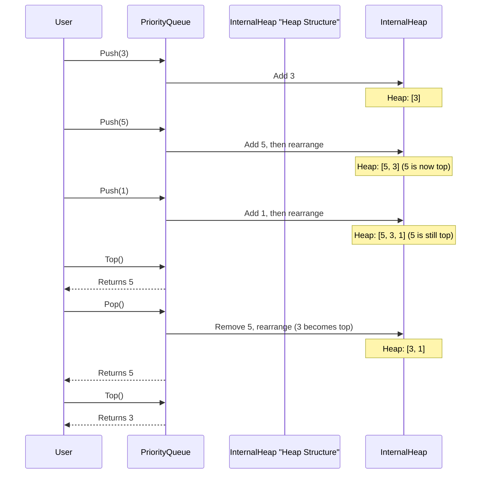

# Chapter 4: Priority Queue

Welcome back to our journey through Data Structures and Algorithms! In our [previous chapter on Prime Number Sieve](03_prime_number_sieve_.md), we learned an efficient way to find special numbers called primes. Now, let's explore a different kind of data structure that helps us manage items based on their "importance": the **Priority Queue**.

## What Problem Does a Priority Queue Solve?

Imagine a special line at an event, like a VIP entrance at a concert or an emergency room at a hospital. In these places, it's not about who arrived first. Instead, it's about who has the highest **priority**. Even if someone arrives later, if they are a VIP or have a critical injury, they get to go first.

A **Priority Queue** works exactly like this! It's a collection of items, but unlike a regular waiting line (where the first one in is the first one out) or a stack (where the last one in is the first one out), a Priority Queue always makes sure that the "most important" item is available first.

This is super useful for many situations:
*   **Emergency Room:** Doctors need to see the most severely injured patient immediately, regardless of their arrival time.
*   **Task Scheduling:** A computer's operating system might prioritize urgent tasks over background downloads.
*   **Finding the "Best" Option:** In many algorithms, you repeatedly need to pick the "best" available item from a constantly changing set, like finding the cheapest flight path or the shortest connection in a network.

## The Priority Queue: Core Idea

At its heart, a Priority Queue is a container that holds items, each with an associated "priority." When you want to retrieve an item, the Priority Queue doesn't give you the one that arrived first or last. It always gives you the item with the **highest priority**.

The definition of "highest priority" can be flexible:
*   For an emergency room, a higher "severity score" means higher priority.
*   For a task list, a lower "deadline time" might mean higher priority.
*   For numbers, the largest number might be highest priority (Max-Priority Queue), or the smallest number might be highest priority (Min-Priority Queue).

## Core Priority Queue Operations

Just like our VIP line, there are specific actions you can perform on a Priority Queue:

| Operation       | Description                                                               | Analogy (Emergency Room)                                   |
| :-------------- | :------------------------------------------------------------------------ | :--------------------------------------------------------- |
| **Push / Insert** | Adds a new item with its priority into the queue.                         | A new patient arrives at the emergency room.               |
| **Pop / Extract** | Removes and returns the item with the **highest priority**.              | The doctor takes the most critical patient to be treated.  |
| **Top / Peek**    | Looks at (but doesn't remove) the item with the **highest priority**.    | The nurse checks who is currently the most critical patient. |
| **isEmpty**     | Checks if there are any items in the queue.                               | Checks if there are any patients waiting.                  |

## Using a Priority Queue: Emergency Room Patients

Let's use our emergency room example to see a Priority Queue in action. We'll use numbers to represent patient severity: `5` means critical, `1` means minor. A higher number means higher priority.

Imagine patients arrive:
1.  Patient A (severity: 2) arrives.
2.  Patient B (severity: 5 - critical!) arrives.
3.  Patient C (severity: 3) arrives.
4.  Patient D (severity: 1) arrives.

If a doctor is ready, who do they treat first? Patient B, because they have the highest severity (5), even though Patient A arrived earlier. After Patient B, who's next? Patient C (severity 3). Then Patient A (severity 2), and finally Patient D (severity 1).

### Code Example (Using C++ `std::priority_queue`)

Most programming languages provide a built-in Priority Queue. In C++, we use `std::priority_queue`, which is part of the Standard Template Library (STL). By default, `std::priority_queue` acts as a **Max-Priority Queue** (largest value has the highest priority).

Here's how we might simulate our emergency room with patients:

```cpp
#include <iostream>
#include <queue> // Required for std::priority_queue
#include <string>

int main() {
    // A priority queue to hold patient severity scores (int).
    // By default, it's a Max-Priority Queue.
    std::priority_queue<int> patientQueue;

    // Patients arrive (Push operations)
    std::cout << "Patients arriving..." << std::endl;
    patientQueue.push(2); // Patient A (Severity 2)
    std::cout << "  Added patient with severity 2." << std::endl;
    patientQueue.push(5); // Patient B (Severity 5 - CRITICAL!)
    std::cout << "  Added patient with severity 5." << std::endl;
    patientQueue.push(3); // Patient C (Severity 3)
    std::cout << "  Added patient with severity 3." << std::endl;
    patientQueue.push(1); // Patient D (Severity 1)
    std::cout << "  Added patient with severity 1." << std::endl;

    std::cout << "\nTreating patients (Pop operations):" << std::endl;
    while (!patientQueue.empty()) {
        int currentSeverity = patientQueue.top(); // See highest priority
        patientQueue.pop();                       // Remove highest priority
        std::cout << "  Treated patient with severity: "
                  << currentSeverity << std::endl;
    }
    return 0;
}
```

**Output:**
```
Patients arriving...
  Added patient with severity 2.
  Added patient with severity 5.
  Added patient with severity 3.
  Added patient with severity 1.

Treating patients (Pop operations):
  Treated patient with severity: 5
  Treated patient with severity: 3
  Treated patient with severity: 2
  Treated patient with severity: 1
```
As you can see, even though patient with severity 2 arrived first, the patient with severity 5 was treated first, followed by 3, 2, and 1. The `top()` operation always gives us the highest number, and `pop()` removes it.

### Min-Priority Queue (Smallest Value First)

Sometimes, you need the *smallest* value to have the highest priority. For example, if you're trying to find the two smallest numbers to combine them (a problem seen in `Level_02/Reduce_the_array.cpp`).

To make `std::priority_queue` a **Min-Priority Queue**, you need to provide an extra detail: `std::greater<int>`.

```cpp
#include <iostream>
#include <queue> // For std::priority_queue
#include <vector> // Required for std::priority_queue's internal container
#include <functional> // Required for std::greater

int main() {
    // A Min-Priority Queue: smallest number has highest priority.
    std::priority_queue<int, std::vector<int>, std::greater<int>> minPQueue;

    std::cout << "Adding numbers to Min-Priority Queue..." << std::endl;
    minPQueue.push(10);
    minPQueue.push(3);
    minPQueue.push(7);
    minPQueue.push(1);

    std::cout << "\nNumbers extracted (smallest first):" << std::endl;
    while (!minPQueue.empty()) {
        std::cout << "  " << minPQueue.top() << std::endl;
        minPQueue.pop();
    }
    return 0;
}
```
**Output:**
```
Adding numbers to Min-Priority Queue...

Numbers extracted (smallest first):
  1
  3
  7
  10
```
Notice how `1` (the smallest) came out first! This is super useful in problems like the one in `Level_02/Reduce_the_array.cpp`, where you repeatedly need to combine the two smallest elements. Similarly, `Level_02/Priority_Queue.cpp` shows how to use it with `std::pair` objects, and `Level_02/Monk_And_Champions_League.cpp` and `Level_02/Monk_and_Multiplication.cpp` illustrate other practical uses of max and min priority queues respectively.

## How Priority Queues Work Internally (Under the Hood)

You might be wondering, how does a Priority Queue magically know which item has the highest priority without checking everything every time? The secret is a special data structure called a **Heap**.

Think of a **Heap** like a well-organized family tree, but with a special rule:
*   **Max-Heap:** Every "parent" is always "greater than or equal to" its "children." This means the largest item is always at the very top of the tree.
*   **Min-Heap:** Every "parent" is always "less than or equal to" its "children." This means the smallest item is always at the very top.

This "heap property" is maintained after every `push` (adding an item) and `pop` (removing an item) operation. When you add a new item, it's put in place and then "bubbles up" if its priority is higher than its parent. When you remove the top item, another item takes its place and "sinks down" until the heap property is restored.

Let's visualize a simple Max-Heap:



### Simplified C++ Internal Implementation (Conceptual)

In C++, `std::priority_queue` is typically implemented on top of a `std::vector` (or another sequence container) and uses functions that perform these "heap" operations (like `std::make_heap`, `std::push_heap`, `std::pop_heap`) behind the scenes. You don't usually need to write the heap logic yourself when using `std::priority_queue`, but it's good to know that this clever heap structure is what makes it so efficient.

For example, when you `push` an element:
1. The new element is added to the end of the underlying `vector`.
2. Then, it "bubbles up" (swaps with its parent) until its position satisfies the heap property.

When you `pop` an element:
1. The top (highest priority) element is taken out.
2. The last element in the `vector` is moved to the top.
3. This new top element "sinks down" (swaps with its largest child) until its position satisfies the heap property.

This ensures that getting the highest priority item (`top()`) is very fast, and `push()` and `pop()` operations are also quite efficient, even for large numbers of items.

## Why Use a Priority Queue?

| Feature             | Stack (LIFO)              | Queue (FIFO)              | Priority Queue (Priority-based)     |
| :------------------ | :------------------------ | :------------------------ | :---------------------------------- |
| **Order of Access** | Last-In, First-Out        | First-In, First-Out       | Highest Priority First              |
| **Best For**        | Undo/Redo, Browser History | Print Queue, Task Queue   | Emergency Room, Task Scheduling, Algorithms needing "best" item repeatedly |
| **Typical Ops**     | Push, Pop, Top            | Enqueue, Dequeue, Front   | Push, Pop, Top                      |

A Priority Queue is your go-to choice when you consistently need to retrieve the "best" or "most important" item, rather than just the one that arrived earliest or latest.

## More Applications of Priority Queues

Beyond our emergency room example, Priority Queues are crucial in many advanced algorithms:

*   **Graph Algorithms:** They are fundamental to algorithms like **Prim's Algorithm** (for finding the minimum spanning tree, as hinted in `Level_05/Prime Algorithm.cpp`, although that specific file shows a basic implementation without `std::priority_queue`, more advanced versions *do* use it) and **Dijkstra's Algorithm** (for finding the shortest path in a graph), which we will explore in [Shortest Path Algorithms](07_shortest_path_algorithms_.md).
*   **Event Simulation:** Managing events that need to happen at specific times, always processing the earliest event next.
*   **Data Compression:** Algorithms like Huffman coding use priority queues to build optimal codes.
*   **Load Balancing:** Distributing tasks to the least busy server.

## Conclusion

The Priority Queue is a powerful and flexible data structure that allows you to manage collections of items based on their importance, always giving you the highest-priority item first. We learned about its core operations (`push`, `pop`, `top`) and saw how to use C++'s `std::priority_queue` for both max-priority (largest value first) and min-priority (smallest value first) scenarios. We also got a peek under the hood, understanding that it's efficiently implemented using a **Heap** data structure. Priority Queues are essential tools for solving problems where the "best" item needs to be accessed repeatedly.

Ready to explore how we represent connections between things? In our next chapter, we'll dive into [Graph Representation](05_graph_representation_.md).

---