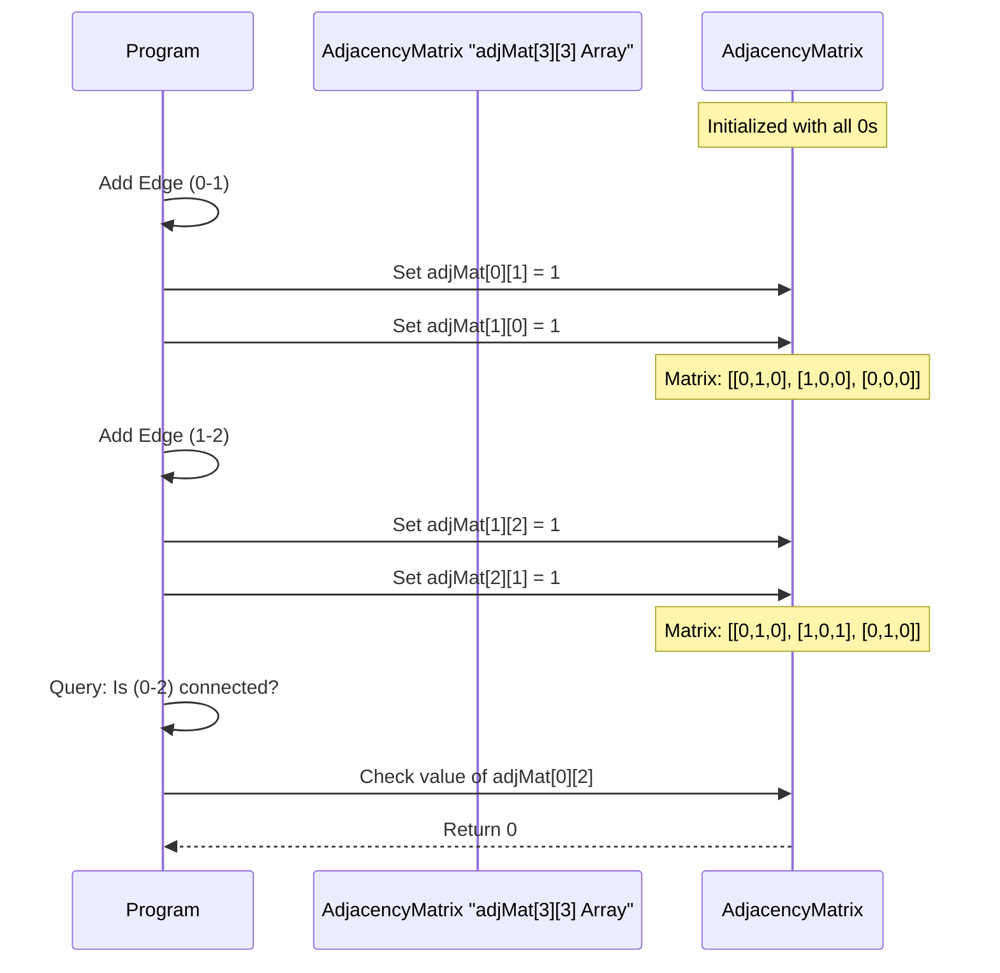
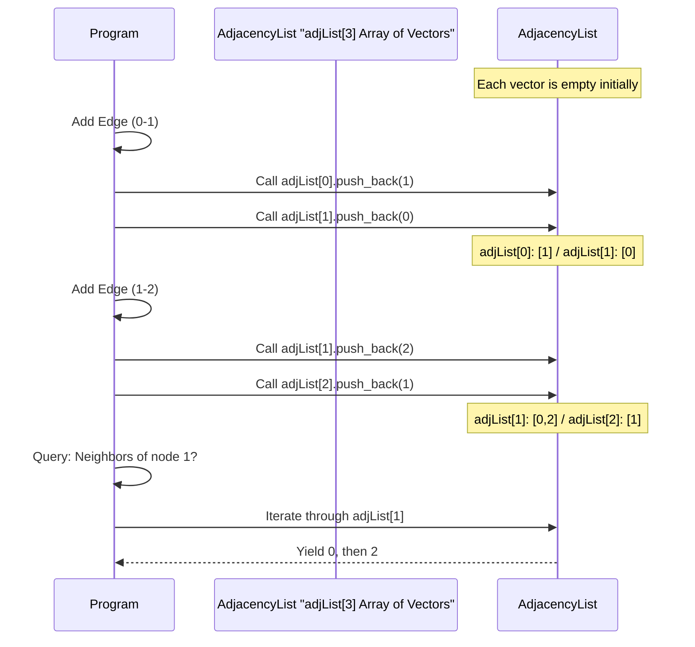

# Chapter 5: Graph Representation

Welcome back to our journey through Data Structures and Algorithms! In our [previous chapter on Priority Queue](04_priority_queue_.md), we learned about organizing data based on its importance, like treating the most critical patient first. Now, let's explore a completely different way to organize and think about data: **Graphs**.

## What Problem Does Graph Representation Solve?

Imagine you have a map, like a subway map, a road map of cities, or even a map of your friends on a social media network. On these maps, you have:

*   **Places/Things:** (e.g., subway stations, cities, people)
*   **Connections:** (e.g., subway lines between stations, roads between cities, friendships between people)

How would a computer store this kind of map? It's not just a simple list or a stack. We need a way to show *who is connected to whom* and *how*. This is exactly what **Graph Representation** helps us do! It's how we store these maps in a computer's memory so we can ask questions like:

*   "Is there a direct road from City A to City B?"
*   "Which cities can I reach directly from City C?"
*   "What are all the people connected to me on this social network?"

In computer science, we call the "places/things" **nodes** (or vertices) and the "connections" **edges**.

## Two Main Ways to Represent a Graph

Just like there are different ways to draw a map (e.g., a simple sketch or a detailed satellite image), there are two main ways to store a graph in a computer:

1.  **Adjacency Matrix** (like a grid/table)
2.  **Adjacency List** (like a list for each node)

Let's dive into each one.

### 1. Adjacency Matrix: The Grid Map

Imagine you have a small map with 3 cities: City 1, City 2, City 3.

An **Adjacency Matrix** is like a big grid or a table. We create a grid where rows and columns represent our cities.

*   If there's a road (edge) between City `i` and City `j`, we put a `1` in the cell where row `i` meets column `j`.
*   If there's no road, we put a `0`.

**Example: A Simple Map**

Let's say we have cities 1, 2, 3.
*   City 1 is connected to City 2.
*   City 2 is connected to City 3.
*   (And because roads usually go both ways, City 2 is connected to City 1, and City 3 is connected to City 2).

Here's how its Adjacency Matrix would look:

| | City 1 | City 2 | City 3 |
| :------- | :----- | :----- | :----- |
| **City 1** | 0 | 1 | 0 |
| **City 2** | 1 | 0 | 1 |
| **City 3** | 0 | 1 | 0 |

Notice that `matrix[1][2]` is 1 (road from 1 to 2) and `matrix[2][1]` is 1 (road from 2 to 1). The diagonal (e.g., `matrix[1][1]`) is usually 0, meaning a city isn't connected to itself.

**How to use it in code (Conceptual C++):**

```cpp
#include <iostream>

const int MAX_CITIES = 5; // Our map can have up to 5 cities
int adjMat[MAX_CITIES][MAX_CITIES]; // A 2D array (our grid)

int main() {
    int numCities = 3; // Let's use 3 cities: 1, 2, 3
    int numRoads = 2;  // Two roads: (1-2), (2-3)

    // Initialize the matrix with all 0s (no roads initially)
    for (int i = 0; i < numCities; ++i) {
        for (int j = 0; j < numCities; ++j) {
            adjMat[i][j] = 0;
        }
    }

    // Add roads (edges)
    // Remember, if city names are 1-based, adjust to 0-based index for arrays
    // For road (1-2) -> adjMat[0][1] and adjMat[1][0]
    adjMat[0][1] = 1; // Road from City 1 to City 2
    adjMat[1][0] = 1; // Road from City 2 to City 1

    adjMat[1][2] = 1; // Road from City 2 to City 3
    adjMat[2][1] = 1; // Road from City 3 to City 2

    // Question: Is there a direct road from City 1 to City 3?
    if (adjMat[0][2] == 1) { // Check adjMat[index for City 1][index for City 3]
        std::cout << "Yes, there is a road." << std::endl;
    } else {
        std::cout << "No, there is no direct road." << std::endl;
    }
    return 0;
}
```
**Output:**
```
No, there is no direct road.
```

The code creates a `MAX_CITIES` by `MAX_CITIES` grid. We initialize it with zeros. Then, for each road, we mark the corresponding cell with a `1`. To check if a road exists, we just look up the value in the grid!
This setup is similar to `Level_04/01_Adjacent matrix , adjacent list/AdjMat.cpp` which takes inputs `n` and `m` and populates a global `adjMat` array.

#### **Pros of Adjacency Matrix:**
*   **Quick Check:** It's super fast to check if a direct connection exists between any two nodes (just look up `adjMat[i][j]`).
*   **Simple:** Easy to understand and implement for smaller graphs.

#### **Cons of Adjacency Matrix:**
*   **Memory Usage:** If you have many cities but very few roads, the matrix will be mostly zeros, wasting a lot of space. For `N` cities, it always uses `N * N` memory, even if `M` (number of roads) is small.
*   **Finding Neighbors:** To find all roads connected to a city, you have to go through its entire row/column, which can be slow if there are many cities.

### 2. Adjacency List: The Address Book Map

Instead of a giant grid, imagine each city has an **address book**. In its address book, a city only lists the names of other cities it has direct roads to.

An **Adjacency List** works just like this. We have a list for *each* node (city), and inside that list, we store all the nodes (cities) that it's directly connected to.

**Example: The Same Simple Map**

Cities 1, 2, 3.
*   City 1 is connected to City 2.
*   City 2 is connected to City 1 and City 3.
*   City 3 is connected to City 2.

Here's how its Adjacency List would look:

*   **City 1:** [2]
*   **City 2:** [1, 3]
*   **City 3:** [2]

**How to use it in code (Conceptual C++):**

```cpp
#include <iostream>
#include <vector> // Required for std::vector

const int MAX_CITIES = 5; // Our map can have up to 5 cities
// An array where each element is a vector (a dynamic list)
std::vector<int> adjList[MAX_CITIES];

int main() {
    int numCities = 3; // Let's use 3 cities: 1, 2, 3
    int numRoads = 2;  // Two roads: (1-2), (2-3)

    // Add roads (edges)
    // For road (1-2) -> add 2 to City 1's list, add 1 to City 2's list
    // If cities are 1-based, adjust indices to 0-based for arrays
    adjList[0].push_back(1); // Add City 2 to City 1's list
    adjList[1].push_back(0); // Add City 1 to City 2's list

    adjList[1].push_back(2); // Add City 3 to City 2's list
    adjList[2].push_back(1); // Add City 2 to City 3's list

    // Question: Which cities are connected to City 2? (index 1)
    std::cout << "Cities connected to City 2 (index 1): ";
    for (int neighbor : adjList[1]) { // Loop through City 2's list
        std::cout << neighbor + 1 << " "; // +1 to print 1-based city names
    }
    std::cout << std::endl;
    return 0;
}
```
**Output:**
```
Cities connected to City 2 (index 1): 1 3 
```
The code uses an array of `std::vector<int>`. Each `adjList[i]` is a vector that stores the indices of cities connected to city `i`. To find all neighbors of a city, we just iterate through its specific vector.
This closely matches `Level_04/01_Adjacent matrix , adjacent list/AdjList.cpp`.

#### **What about Weighted Graphs?**
Sometimes, roads have different "weights" or costs, like distance or travel time.
*   For an **Adjacency Matrix**, instead of `1` or `0`, you'd store the actual weight. `adjMat[i][j] = 10` could mean 10 miles. `0` or a very large number might indicate no connection.
*   For an **Adjacency List**, each entry in a city's list would be a pair: `(neighbor_city, weight)`. For example, `adjList[0]` could contain `(1, 5)` meaning City 0 is connected to City 1 with a weight of 5. This is demonstrated in `Level_04/01_Adjacent matrix , adjacent list/AdjListWeighted.cpp` where `vector<pair<int,int>> adj[mx];` is used.

#### **Pros of Adjacency List:**
*   **Memory Efficient:** For maps with few roads (sparse graphs), it saves a lot of memory because it only stores actual connections.
*   **Finding Neighbors:** It's very efficient to find all neighbors of a specific node; you just access its list.

#### **Cons of Adjacency List:**
*   **Check Connection:** To check if a direct connection exists between two *specific* nodes, you might have to scan through a list, which can be slower than the Adjacency Matrix's direct lookup.

## How Graph Representations Work Internally (Under the Hood)

Both representations use familiar data structures you've already learned about!

### Adjacency Matrix Internal View: A 2D Array

The Adjacency Matrix is directly implemented as a two-dimensional array (or array of arrays). Each cell in this grid is a memory spot.


This shows how changes to connections (edges) directly modify the cells in the `adjMat` array.

### Adjacency List Internal View: An Array of Vectors

The Adjacency List is typically an array where each element of the array is a dynamic list (like `std::vector` in C++).


Here, adding an edge means adding elements to the `std::vector` at the correct index in the `adjList` array. When querying neighbors, you simply iterate through that specific vector.

## Adjacency Matrix vs. Adjacency List: A Quick Comparison

| Feature                  | Adjacency Matrix                       | Adjacency List                               |
| :----------------------- | :------------------------------------- | :------------------------------------------- |
| **Storage**              | Fixed size: `N * N`                    | Flexible size: `N + 2 * M` (N nodes, M edges) |
| **Best for**             | Dense graphs (many connections)        | Sparse graphs (few connections)              |
| **Check (u,v) exists**   | Fast: `O(1)` (direct lookup)           | Slower: `O(degree(u))` (scan list)          |
| **Find all neighbors of u** | Slower: `O(N)` (scan row/column)       | Fast: `O(degree(u))` (iterate list)         |
| **Analogy**              | Grid map                               | Address book for each city                   |

*Note: `N` is the number of nodes, `M` is the number of edges. `degree(u)` means the number of connections node `u` has.*

## Conclusion

Graph representation is all about how you store connections between items in a computer. We explored two primary methods: the **Adjacency Matrix**, which uses a grid for fast connection checks, and the **Adjacency List**, which uses lists for each node, saving space and being efficient for finding all a node's neighbors. Each method has its strengths and weaknesses, making one more suitable than the other depending on the specific "map" (graph) you are working with.

Understanding how to represent graphs is the first crucial step. Now that we know how to store these maps, we're ready to learn how to **explore** them! In our next chapter, we'll dive into [Graph Traversal](06_graph_traversal_.md) algorithms.

---