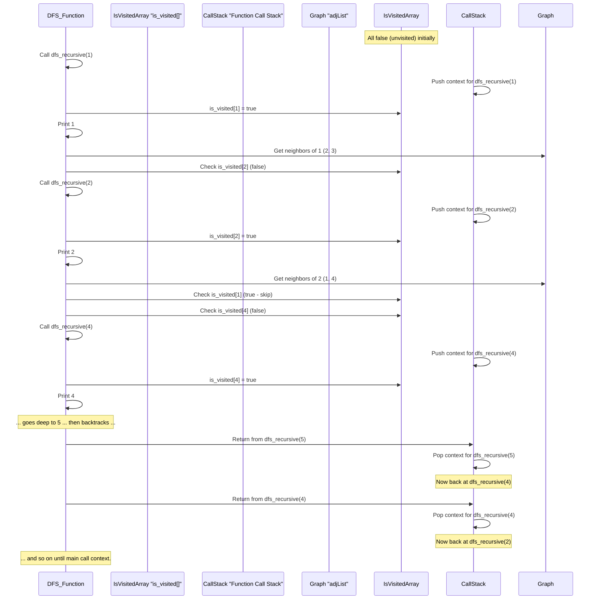

# Chapter 6: Graph Traversal

Welcome back to our exciting journey through Data Structures and Algorithms! In our [previous chapter on Graph Representation](05_graph_representation_.md), we learned how to store maps of "places" and "connections" inside a computer. Now that we know how to represent these maps, how do we actually *explore* them? How do we find our way around?

## What Problem Does Graph Traversal Solve?

Imagine you're lost in a huge, unfamiliar maze, or trying to find all the different rooms in a big castle. You don't want to miss any path, and you want a systematic way to make sure you visit every single reachable corner.

In the world of computers, a **Graph Traversal** algorithm is exactly that: a systematic strategy for visiting every single "place" (node) and "connection" (edge) in a graph. It's like having a plan to explore every part of our digital map.

Why is this important?
*   **Finding paths:** Is there a way from City A to City B?
*   **Discovering connected parts:** Which parts of the network can reach each other?
*   **Locating items:** Find a specific file in a tangled web of folders.
*   **Analyzing social networks:** Who are all my friends, and their friends, and so on?

There are two fundamental strategies for exploring a graph, each with its own way of "moving" through the connections:

1.  **Breadth-First Search (BFS)**
2.  **Depth-First Search (DFS)**

Let's explore them!

## 1. Breadth-First Search (BFS): The "Level by Level" Explorer

Think of BFS like dropping a stone into a pond and watching the ripples spread out. The first ripple hits all immediate neighbors. The second ripple hits their neighbors, and so on. BFS explores a graph **level by level** or **layer by layer**. It visits all the nodes directly connected to the starting node first, then all their unvisited neighbors, and so on.

**Analogy:** Imagine exploring a castle. You visit all rooms directly accessible from your current room. Then, from those new rooms, you visit all *their* new, unvisited rooms, before going deeper into any one branch.

**How it works (Step-by-Step):**

To keep track of which nodes to visit next, and to make sure we visit nodes level by level, BFS uses a **Queue** data structure. (Remember our [Stack Data Structure](01_stack_data_structure_.md) and how a Queue is its opposite: First-In, First-Out?)

Let's explore a simple graph starting from Node 1:

```
Graph:
1 -- 2
|    |
3 -- 4
     |
     5
```

Nodes: 1, 2, 3, 4, 5. Connections: (1,2), (1,3), (2,4), (3,4), (4,5)

1.  **Start at Node 1.** Mark Node 1 as "visited" and add it to a `queue`.
    *   Visited: {1}
    *   Queue: [1]
2.  **Take Node 1 out of the `queue`.** Look at its direct neighbors: 2, 3.
    *   Node 2 is not visited. Mark 2 as "visited", add 2 to `queue`.
    *   Node 3 is not visited. Mark 3 as "visited", add 3 to `queue`.
    *   Visited: {1, 2, 3}
    *   Queue: [2, 3]
3.  **Take Node 2 out of the `queue`.** Look at its direct neighbors: 1, 4.
    *   Node 1 is already visited. Skip.
    *   Node 4 is not visited. Mark 4 as "visited", add 4 to `queue`.
    *   Visited: {1, 2, 3, 4}
    *   Queue: [3, 4]
4.  **Take Node 3 out of the `queue`.** Look at its direct neighbors: 1, 4.
    *   Node 1 is already visited. Skip.
    *   Node 4 is already visited. Skip.
    *   Visited: {1, 2, 3, 4}
    *   Queue: [4]
5.  **Take Node 4 out of the `queue`.** Look at its direct neighbors: 2, 3, 5.
    *   Node 2 is already visited. Skip.
    *   Node 3 is already visited. Skip.
    *   Node 5 is not visited. Mark 5 as "visited", add 5 to `queue`.
    *   Visited: {1, 2, 3, 4, 5}
    *   Queue: [5]
6.  **Take Node 5 out of the `queue`.** No unvisited neighbors.
    *   Visited: {1, 2, 3, 4, 5}
    *   Queue: [] (Empty!)

The BFS order of visiting nodes from 1 is: **1 -> 2 -> 3 -> 4 -> 5**.

### Code Example (Simplified C++ BFS)

This code is a simplified version of what you might find in `Level_04/04_ Breadth First Search/Bfs.cpp`. We'll use an Adjacency List (from [Graph Representation](05_graph_representation_.md)) to store the graph.

```cpp
#include <iostream>
#include <vector>
#include <queue> // For the queue

const int MAX_NODES = 123;
std::vector<int> adj[MAX_NODES]; // Adjacency List for graph
int visited[MAX_NODES];          // To keep track of visited nodes

void bfs(int start_node) {
    visited[start_node] = 1; // Mark start node as visited
    std::queue<int> q;       // Create a queue
    q.push(start_node);      // Add start node to queue

    while (!q.empty()) { // Keep going as long as there are nodes to visit
        int current_node = q.front(); // Get the front node
        q.pop();                      // Remove it from queue
        std::cout << current_node << " "; // "Visit" the node (print it)

        // Explore neighbors of current_node
        for (int neighbor : adj[current_node]) {
            if (visited[neighbor] == 0) { // If neighbor not visited
                visited[neighbor] = 1;    // Mark it visited
                q.push(neighbor);         // Add it to queue
            }
        }
    }
}

int main() {
    // Add graph connections for our example (1-based indexing for clarity)
    // Make sure to adjust for 0-based if using arrays starting at 0
    adj[1].push_back(2); adj[2].push_back(1);
    adj[1].push_back(3); adj[3].push_back(1);
    adj[2].push_back(4); adj[4].push_back(2);
    adj[3].push_back(4); adj[4].push_back(3);
    adj[4].push_back(5); adj[5].push_back(4);

    // Call BFS starting from node 1
    std::cout << "BFS traversal starting from node 1: ";
    bfs(1);
    std::cout << std::endl;
    return 0;
}
```

**Output:**
```
BFS traversal starting from node 1: 1 2 3 4 5 
```

**Explanation:**
*   `adj`: This is our graph, stored as an Adjacency List. `adj[u]` lists all nodes `v` that `u` is connected to.
*   `visited`: This array is crucial. We mark a node as `1` (visited) when we first encounter it and add it to the queue. This prevents us from visiting the same node multiple times and getting stuck in loops.
*   `queue q`: This is the heart of BFS. It stores the nodes we need to visit next, ensuring we process them in the order they were discovered (level by level).

### How BFS Works Internally: The Queue in Action

```mermaid
sequenceDiagram
    participant BFS_Function
    participant VisitedArray "visited[]"
    participant Queue "std::queue"
    participant Graph "adjList"

    Note over VisitedArray: All 0 (unvisited) initially

    BFS_Function->>BFS_Function: Start BFS(1)
    BFS_Function->>VisitedArray: visited[1] = 1
    BFS_Function->>Queue: Push(1)
    Note over Queue: [1]

    loop while Queue is not empty
        BFS_Function->>Queue: Pop() (1)
        Note over Queue: []
        BFS_Function->>BFS_Function: Print 1

        BFS_Function->>Graph: Get neighbors of 1 (2, 3)
        BFS_Function->>VisitedArray: Check visited[2] (0)
        BFS_Function->>VisitedArray: visited[2] = 1
        BFS_Function->>Queue: Push(2)

        BFS_Function->>VisitedArray: Check visited[3] (0)
        BFS_Function->>VisitedArray: visited[3] = 1
        BFS_Function->>Queue: Push(3)
        Note over Queue: [2, 3]

        BFS_Function->>Queue: Pop() (2)
        Note over Queue: [3]
        BFS_Function->>BFS_Function: Print 2

        BFS_Function->>Graph: Get neighbors of 2 (1, 4)
        BFS_Function->>VisitedArray: Check visited[1] (1 - skip)
        BFS_Function->>VisitedArray: Check visited[4] (0)
        BFS_Function->>VisitedArray: visited[4] = 1
        BFS_Function->>Queue: Push(4)
        Note over Queue: [3, 4]
    end
    Note over BFS_Function: ... continues until queue empty ...
```
This diagram shows how `BFS` systematically uses the `queue` to ensure that it explores all nodes at the current "depth" or "level" before moving on to the next deeper level.

## 2. Depth-First Search (DFS): The "Go Deep" Explorer

Think of DFS like exploring a maze by taking one path as far as you can go. If you hit a dead end, you backtrack (go back) and try another path. DFS explores a graph by going as **deep** as possible along each branch before backtracking.

**Analogy:** You're in a library. You pick one shelf, and you go to the very last book on that shelf. If you can't go further, you step back to the previous book, then the previous, until you find a new, unread book to go deep on again.

**How it works (Step-by-Step):**

DFS can be implemented in two main ways: using **recursion** (which uses the computer's built-in call stack) or by explicitly using a **Stack** data structure. Both achieve the "go deep, then backtrack" behavior.

Let's explore the same graph starting from Node 1:

```
Graph:
1 -- 2
|    |
3 -- 4
     |
     5
```

Nodes: 1, 2, 3, 4, 5. Connections: (1,2), (1,3), (2,4), (3,4), (4,5)

1.  **Start at Node 1.** Mark Node 1 as "visited". "Visit" Node 1 (print it).
    *   Visited: {1}
    *   Output: 1
2.  **From Node 1, pick a neighbor (e.g., Node 2).**
    *   Node 2 is not visited. Mark 2 as "visited". "Visit" Node 2.
    *   Visited: {1, 2}
    *   Output: 1 2
3.  **From Node 2, pick a neighbor (e.g., Node 4).**
    *   Node 4 is not visited. Mark 4 as "visited". "Visit" Node 4.
    *   Visited: {1, 2, 4}
    *   Output: 1 2 4
4.  **From Node 4, pick a neighbor (e.g., Node 5).**
    *   Node 5 is not visited. Mark 5 as "visited". "Visit" Node 5.
    *   Visited: {1, 2, 4, 5}
    *   Output: 1 2 4 5
5.  **From Node 5, no unvisited neighbors.** Backtrack to Node 4.
6.  **From Node 4, check other neighbors (2, 3).**
    *   Node 2 is visited. Skip.
    *   Node 3 is not visited. Mark 3 as "visited". "Visit" Node 3.
    *   Visited: {1, 2, 3, 4, 5}
    *   Output: 1 2 4 5 3
7.  **From Node 3, check neighbors (1, 4).** Both are visited. Backtrack to Node 4.
8.  **From Node 4, all neighbors processed.** Backtrack to Node 2.
9.  **From Node 2, all neighbors processed.** Backtrack to Node 1.
10. **From Node 1, check other neighbors (3).** Node 3 is visited. All neighbors processed.

The DFS order of visiting nodes from 1 (depends on neighbor order): **1 -> 2 -> 4 -> 5 -> 3** (or 1 -> 3 -> 4 -> 2 -> 5, etc.)

### Code Example (Simplified C++ Recursive DFS)

This is a simplified version of `Level_04/02_Graph Traversal Using DFS/Dfs_Recursion.cpp`. DFS is often elegantly written using recursion.

```cpp
#include <iostream>
#include <vector>

const int MAX_NODES = 123;
std::vector<int> adj[MAX_NODES]; // Adjacency List for graph
bool is_visited[MAX_NODES];      // To keep track of visited nodes

void dfs_recursive(int current_node) {
    is_visited[current_node] = true; // Mark current node as visited
    std::cout << current_node << " "; // "Visit" the node (print it)

    // Explore neighbors of current_node
    for (int neighbor : adj[current_node]) {
        if (!is_visited[neighbor]) { // If neighbor not visited
            dfs_recursive(neighbor); // Go deeper (recursive call)
        }
    }
}

int main() {
    // Graph connections (1-based indexing for clarity)
    adj[1].push_back(2); adj[2].push_back(1);
    adj[1].push_back(3); adj[3].push_back(1);
    adj[2].push_back(4); adj[4].push_back(2);
    adj[3].push_back(4); adj[4].push_back(3);
    adj[4].push_back(5); adj[5].push_back(4);

    // Call DFS starting from node 1
    std::cout << "DFS traversal starting from node 1: ";
    dfs_recursive(1);
    std::cout << std::endl;
    return 0;
}
```
**Output:**
```
DFS traversal starting from node 1: 1 2 4 5 3 
```

**Explanation:**
*   The `dfs_recursive` function calls itself for each unvisited neighbor. This is the "go deeper" part. When a path runs out of unvisited neighbors, the function calls "return", which automatically handles the "backtracking" to the previous node in the path.

### Code Example (Simplified C++ Iterative DFS with Stack)

You can also implement DFS using an explicit `std::stack` (as hinted in `Level_04/02_Graph Traversal Using DFS/Dfs_Stack.cpp`). This is useful if recursion depth is a concern.

```cpp
#include <iostream>
#include <vector>
#include <stack> // For the stack

const int MAX_NODES = 123;
std::vector<int> adj[MAX_NODES]; // Adjacency List for graph
int visited_iterative[MAX_NODES]; // To keep track of visited nodes

void dfs_iterative(int start_node) {
    std::stack<int> s;         // Create a stack
    s.push(start_node);        // Add start node to stack
    visited_iterative[start_node] = 1; // Mark as visited

    while (!s.empty()) { // Keep going as long as there are nodes to visit
        int current_node = s.top(); // Get the top node
        s.pop();                    // Remove it from stack
        std::cout << current_node << " "; // "Visit" the node (print it)

        // Explore neighbors of current_node
        // Note: For consistent output with recursive DFS,
        // often neighbors are pushed in reverse order or sorted.
        // For simplicity, we just push as found.
        for (int neighbor : adj[current_node]) {
            if (visited_iterative[neighbor] == 0) { // If neighbor not visited
                visited_iterative[neighbor] = 1;    // Mark it visited
                s.push(neighbor);                   // Add it to stack
            }
        }
    }
}

// Same main function as recursive DFS for graph setup...
int main() {
    // Graph connections (1-based indexing for clarity)
    adj[1].push_back(2); adj[2].push_back(1);
    adj[1].push_back(3); adj[3].push_back(1);
    adj[2].push_back(4); adj[4].push_back(2);
    adj[3].push_back(4); adj[4].push_back(3);
    adj[4].push_back(5); adj[5].push_back(4);

    // Call Iterative DFS starting from node 1
    std::cout << "Iterative DFS traversal starting from node 1: ";
    dfs_iterative(1);
    std::cout << std::endl;
    return 0;
}
```
**Output:**
```
Iterative DFS traversal starting from node 1: 1 3 4 5 2 
```
*Note: The exact output order for iterative DFS can vary based on how neighbors are processed (e.g., if `adj` lists are sorted, or if neighbors are pushed in reverse order). This specific output comes from the order of neighbors in `adj` and pushing them as they appear.*

### How DFS Works Internally: The Stack (or Recursion) in Action


This diagram shows how `DFS` uses the **call stack** (implicitly with recursion, or explicitly with `std::stack`) to keep track of the path it's currently exploring. When it hits a dead end or visited node, it pops from the stack to "backtrack."

## BFS vs. DFS: A Quick Comparison

Both BFS and DFS are powerful for graph traversal, but they explore graphs in different orders and have different strengths:

| Feature          | Breadth-First Search (BFS)                  | Depth-First Search (DFS)                      |
| :--------------- | :------------------------------------------ | :-------------------------------------------- |
| **Order of Visit** | Explores level by level (closest first)     | Explores as deep as possible down one path      |
| **Data Structure** | Queue                                       | Stack (or recursion, which uses a call stack)   |
| **Path Finding** | Finds shortest path in **unweighted** graphs | Useful for any path, but not necessarily shortest |
| **Memory**       | Can use more memory if graph is "wide" (many neighbors) | Can use more memory if graph is "deep" (long paths) |
| **Use Cases**    | Finding shortest path, web crawlers, "all neighbors at distance N" | Detecting cycles, topological sorting, finding connected components |

You can see examples of BFS being used to calculate shortest paths (in unweighted graphs) and levels in files like `Level_04/05_ Shortest path using BFS and Lavel calculation/We_Ship_Cheap.cpp` and `Level_04/04_ Breadth First Search/Monk_and_the_Islands.cpp`. DFS is used for finding connected components as seen in `Level_04/03_Finding connected components of graph (bi-coloring)/Connected_Components_in_a_Graph.cpp` and for problems on grid-like graphs like `Level_04/04_ Breadth First Search/Guilty_Prince.cpp`. Both are fundamental!

## Conclusion

Graph Traversal algorithms provide systematic ways to explore every part of a graph. We've learned about two primary methods: **Breadth-First Search (BFS)**, which explores level by level using a Queue, and **Depth-First Search (DFS)**, which explores as deep as possible down one path using a Stack (or recursion). Understanding how these algorithms work is crucial for solving a wide range of problems, from finding paths in a maze to analyzing complex networks.

Now that we know how to traverse graphs, we can use these techniques to find the "best" paths! In our next chapter, we'll dive into [Shortest Path Algorithms](07_shortest_path_algorithms_.md).

---
