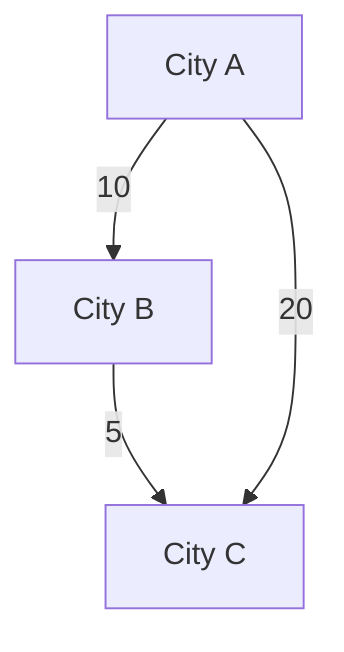
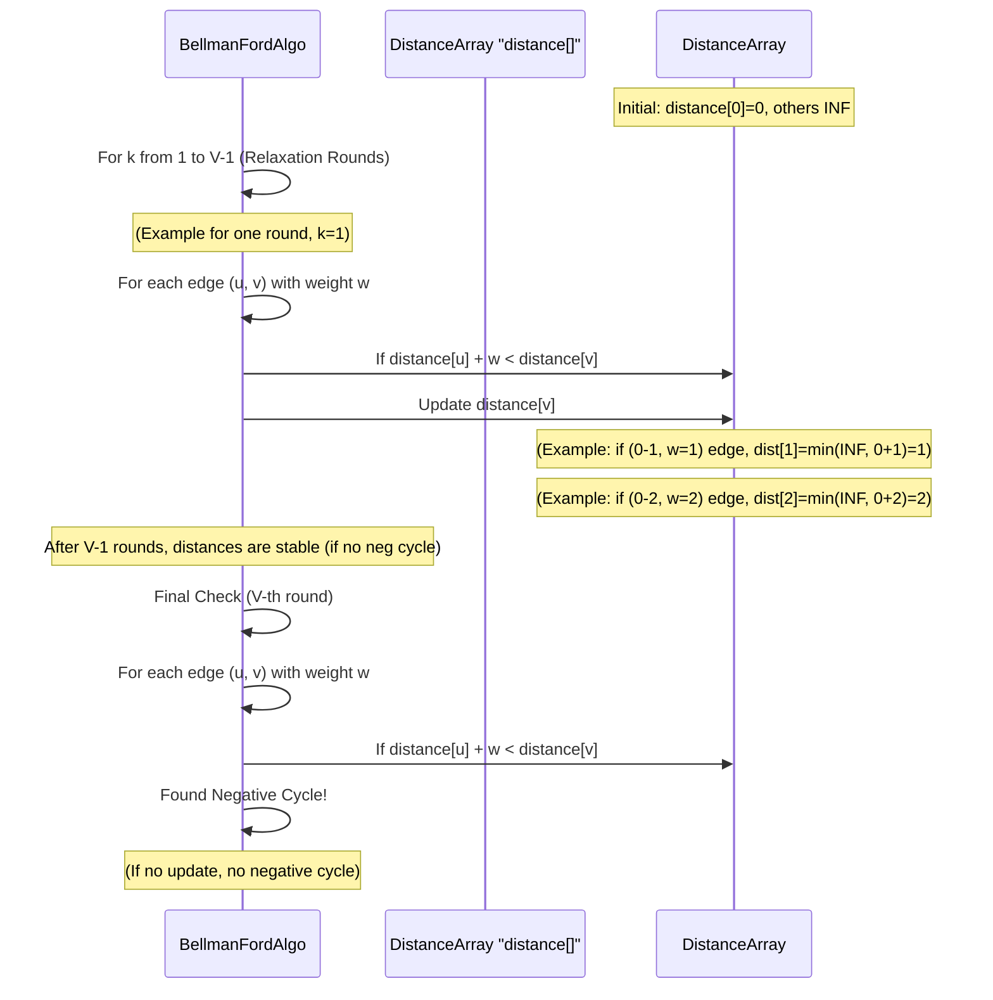
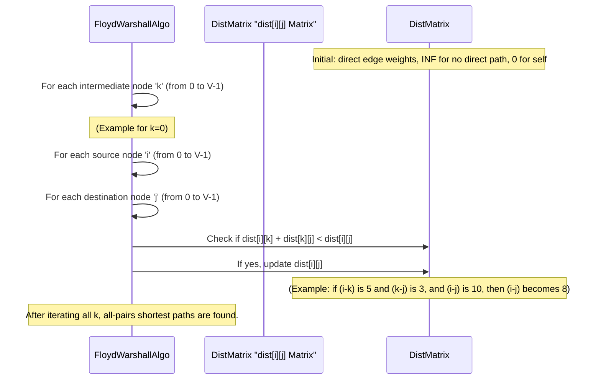

# Chapter 7: Shortest Path Algorithms

Welcome back to our exciting journey through Data Structures and Algorithms! In our [previous chapter on Graph Traversal](06_graph_traversal_.md), we learned how to systematically explore every part of a map (graph) using techniques like BFS and DFS. Now, let's take that a step further: what if we don't just want to *explore* the map, but find the *best* way to get from one place to another?

## What Problem Do Shortest Path Algorithms Solve?

Imagine you're planning a road trip from City A to City B. You don't just want *any* route; you want the *fastest* route, or maybe the one that uses the *least fuel*. What if some roads have tolls (costs), or some are faster (lower time cost)?

This is where **Shortest Path Algorithms** come in! These are powerful techniques used in computer science to calculate the most efficient way to travel between two points in a graph. The "efficiency" is usually measured by "cost" or "weight" associated with each connection (road). This "cost" could be:
*   **Distance:** The shortest physical distance.
*   **Time:** The fastest travel time.
*   **Cost:** The cheapest path (e.g., minimum toll fees, or minimum fuel consumption).

These algorithms are super important for:
*   **GPS Navigation:** Finding the quickest route on your phone's map.
*   **Network Routing:** How data packets find the fastest way through the internet.
*   **Logistics:** Optimizing delivery routes for trucks.
*   **Game AI:** How characters find their way around a game world.

In this chapter, we'll look at three famous Shortest Path Algorithms: **Dijkstra's Algorithm**, **Bellman-Ford Algorithm**, and **Floyd-Warshall Algorithm**. Each has its own strengths, depending on the kind of "costs" (weights) in your map and what kind of paths you want to find.

## Weighted Graphs: Adding "Cost" to Connections

Before we dive into the algorithms, let's remember that roads (edges) in our map (graph) can have **weights** or **costs**. In [Graph Representation](05_graph_representation_.md), we briefly mentioned weighted graphs. For example, a connection from City A to City B might have a weight of `10` (meaning 10 miles, 10 minutes, or 10 dollars).


In this simple map:
*   Going A to B costs 10.
*   Going B to C costs 5.
*   Going A to C directly costs 20.

The "shortest path" from A to C is actually A -> B -> C, with a total cost of 10 + 5 = 15, which is cheaper than the direct path of 20. Shortest path algorithms figure this out!

## 1. Dijkstra's Algorithm: The Positive-Weight Pathfinder

Dijkstra's Algorithm (pronounced "Dike-stra") is like a smart GPS that finds the cheapest or fastest way from *one starting point* to *all other reachable places* on your map, but it works only if all the "costs" (weights) on the roads are **positive** (no free rides or getting paid to travel!).

**Problem Solved:** Shortest path from a single source node to all other nodes in a graph with non-negative edge weights.

**Analogy:** You want to find the cheapest flights from *your city* to *every other city* in the country. Dijkstra's will help you, as long as flight prices are always positive (you don't get paid to fly!).

**How it Works (Step-by-Step Idea):**

Dijkstra's is a "greedy" algorithm. It works by building up the shortest path to nodes step by step. It always picks the unvisited city that currently has the *shortest known travel time* from your starting city.

1.  **Preparation:**
    *   Keep track of the "shortest distance found so far" to every city from your starting city. Let's call this `distance[]`. Initially, `distance[start_city]` is 0, and `distance` for all other cities is "infinity" (meaning we don't know how to get there yet).
    *   Keep track of which cities we've already **finalized** the shortest path for. Let's call this `visited[]`. Initially, all are unvisited.
2.  **Repetition:** Repeat `V-1` times (where `V` is the number of cities):
    *   **Pick the "Closest":** Find the unvisited city `u` that has the smallest value in `distance[]`. This is the city we will "visit" next.
    *   **Mark as Visited:** Mark city `u` as `visited`. Its `distance[u]` is now finalized as the shortest path from the start.
    *   **Update Neighbors:** For every neighbor `v` of `u`:
        *   If `v` is not `visited` and a path through `u` to `v` (`distance[u] + weight(u,v)`) is shorter than `distance[v]`, then update `distance[v]` to this new shorter value. This step is called "relaxation".

The `findMinDistence` function (in the code example below) is what helps pick the "Closest" node efficiently. For larger graphs, a [Priority Queue](04_priority_queue_.md) is used to speed up this picking process, as it always keeps the smallest element at the top!

```mermaid
sequenceDiagram
    participant DijkstraAlgo
    participant DistanceArray "distance[]"
    participant VisitedArray "visited[]"

    Note over DistanceArray,VisitedArray: Initial state: distance[0]=0, others INF; all unvisited

    DijkstraAlgo->>DijkstraAlgo: Loop V-1 times
    DijkstraAlgo->>DistanceArray: Find unvisited node 'u' with min distance
    Note over DistanceArray: (Example: u=0, dist[0]=0)

    DijkstraAlgo->>VisitedArray: Mark visited[u] = true
    Note over VisitedArray: visited[0]=true

    DijkstraAlgo->>DistanceArray: For each neighbor 'v' of 'u':
    Note over DijkstraAlgo: (Example: For u=0, neighbors 1, 2)
    DijkstraAlgo->>DistanceArray: If distance[u] + weight(u,v) < distance[v]
    DijkstraAlgo->>DistanceArray: Update distance[v]
    Note over DistanceArray: (Example: dist[1] = min(INF, 0+2)=2; dist[2]=min(INF, 0+4)=4)

    DijkstraAlgo->>DijkstraAlgo: Repeat: Pick next unvisited min (Example: u=1, dist[1]=2)
    DijkstraAlgo->>VisitedArray: Mark visited[1] = true
    DijkstraAlgo->>DistanceArray: Update neighbors of 1
    Note over DistanceArray: (Example: dist[2]=min(4, 2+1)=3; dist[3]=min(INF, 2+7)=9)
    Note over DijkstraAlgo: Algorithm continues until all nodes are visited or distances are finalized.
```

### Code Example (Simplified C++ Dijkstra's)

This code is based on `Level_05/Dijkstra Algorithm.cpp`. We use an Adjacency Matrix for the graph for simplicity in this example.

```cpp
#include <iostream>
#include <vector> // For std::vector if using adjacency list, or just for clarity

const int V = 6;    // Number of nodes (cities)
const int INF = 10000000; // Represents infinity (a very large number)

// This function finds the unvisited node with the smallest current distance
int findMinDistanceNode(int distance[], bool visited[]) {
    int min_val = INF;
    int min_index = -1;
    for (int i = 0; i < V; i++) {
        if (!visited[i] && distance[i] <= min_val) {
            min_val = distance[i];
            min_index = i;
        }
    }
    return min_index;
}

void dijkstra(int graph[V][V], int start_node) {
    int distance[V];   // Stores shortest distance from start_node to i
    bool visited[V];   // True if shortest path to node i is finalized

    // Step 1: Initialize distances and visited status
    for (int i = 0; i < V; i++) {
        distance[i] = INF; // All distances are "infinity" initially
        visited[i] = false; // No nodes visited yet
    }
    distance[start_node] = 0; // Distance to start_node itself is 0

    // Step 2: Find shortest path for all nodes
    for (int count = 0; count < V - 1; count++) {
        int u = findMinDistanceNode(distance, visited); // Pick the closest unvisited node

        if (u == -1) break; // No reachable unvisited nodes left

        visited[u] = true; // Mark it as visited (shortest path finalized)

        // Step 3: Update distances of neighbors of u
        for (int v = 0; v < V; v++) {
            // Check if v is not visited, there's an edge from u to v,
            // u is reachable, and path through u is shorter to v
            if (!visited[v] && graph[u][v] != INF && distance[u] != INF &&
                distance[u] + graph[u][v] < distance[v]) {
                distance[v] = distance[u] + graph[u][v]; // Update distance
            }
        }
    }

    // Print the calculated shortest distances
    std::cout << "Shortest distances from node " << start_node << ":" << std::endl;
    for (int i = 0; i < V; i++) {
        if (distance[i] == INF) {
            std::cout << "Node " << i << ": INF" << std::endl;
        } else {
            std::cout << "Node " << i << ": " << distance[i] << std::endl;
        }
    }
}

int main() {
    // Example Graph (Adjacency Matrix) with positive weights
    // INF means no direct connection
    int graph[V][V] = {
        {0, 2, 4, INF, INF, INF},
        {INF, 0, 1, 7, INF, INF},
        {INF, INF, 0, INF, 3, INF},
        {INF, INF, INF, 0, INF, 1},
        {INF, INF, INF, 2, 0, 5},
        {INF, INF, INF, INF, INF, 0}
    };

    dijkstra(graph, 0); // Start from node 0
    return 0;
}
```
**Output:**
```
Shortest distances from node 0:
Node 0: 0
Node 1: 2
Node 2: 3
Node 3: 9
Node 4: 6
Node 5: 10
```
This output tells us the shortest path from node 0 to node 0 is 0, to node 1 is 2, to node 2 is 3 (0->1->2), and so on.

**Why positive weights only?** Dijkstra's "greedy" choice (always picking the smallest current distance) falls apart if there are negative weights. A negative weight could make a path that looked longer suddenly become shorter after passing through a negative edge.

## 2. Bellman-Ford Algorithm: The Negative-Weight Pathfinder (and Cycle Detector)

What if your map has "roads" where the "cost" is negative? This might sound strange, but in some problems (like currency exchange), a "cost" could represent a profit. If there's a "cycle" (a loop) of negative costs, you could theoretically go around that loop infinitely to make infinite profit!

The **Bellman-Ford Algorithm** can handle these **negative edge weights**. It's also special because it can **detect negative cycles** in a graph.

**Problem Solved:** Shortest path from a single source node to all other nodes in a graph that *may have negative edge weights*. It can also detect if a negative cycle is reachable from the source.

**Analogy:** A financial analyst looking for the most profitable sequence of currency exchanges. Some exchanges might yield a "negative cost" (i.e., a profit). If they find a loop where they keep making money, that's a negative cycle.

**How it Works (Step-by-Step Idea):**

Bellman-Ford works differently than Dijkstra's. Instead of picking the "closest" node, it repeatedly tries to relax *all* edges in the graph many times.

1.  **Preparation:**
    *   Initialize `distance[]` to "infinity" for all nodes, except `distance[start_node] = 0`.
2.  **Relaxation Rounds:** Repeat `V - 1` times (where `V` is the number of nodes):
    *   For *every* edge (u, v) with weight `w` in the graph:
        *   If `distance[u] + w` is less than `distance[v]`, then update `distance[v] = distance[u] + w`.
    *   *(Each round ensures that paths with one more edge are correctly considered.)*
3.  **Negative Cycle Check:** After `V - 1` rounds, run one more relaxation round (the V-th round).
    *   If any distance `distance[v]` *still* changes during this `V`-th round, it means there's a **negative cycle** reachable from the source, because a path can keep getting shorter.



### Code Example (Simplified C++ Bellman-Ford)

This code is based on `Level_05/Bellman Ford Algorithm.cpp` and `Level_05/Bellman Ford Algorithm (Negative Cycle).cpp`. We assume graph is given as an adjacency matrix for simplicity.

```cpp
#include <iostream>
#include <vector>

const int V_BF = 4; // Number of nodes (cities) for Bellman-Ford example
const int INF_BF = 10000000; // Represents infinity

void bellmanFord(int graph[V_BF][V_BF], int start_node) {
    std::vector<int> distance(V_BF, INF_BF); // Dynamic array for distances

    distance[start_node] = 0; // Distance to start_node itself is 0

    // Step 1: Relax all edges V-1 times
    for (int k = 0; k < V_BF - 1; k++) { // V-1 iterations
        for (int u = 0; u < V_BF; u++) { // For each source node u
            for (int v = 0; v < V_BF; v++) { // For each destination node v
                if (graph[u][v] != INF_BF) { // If there's an edge from u to v
                    // Relaxation step
                    if (distance[u] != INF_BF && distance[u] + graph[u][v] < distance[v]) {
                        distance[v] = distance[u] + graph[u][v];
                    }
                }
            }
        }
    }

    // Step 2: Check for negative cycles
    bool hasNegativeCycle = false;
    for (int u = 0; u < V_BF; u++) {
        for (int v = 0; v < V_BF; v++) {
            if (graph[u][v] != INF_BF) {
                if (distance[u] != INF_BF && distance[u] + graph[u][v] < distance[v]) {
                    hasNegativeCycle = true;
                    break; // Found a negative cycle
                }
            }
        }
        if (hasNegativeCycle) break;
    }

    if (hasNegativeCycle) {
        std::cout << "Graph contains a negative-weight cycle!" << std::endl;
    } else {
        std::cout << "Shortest distances from node " << start_node << " (Bellman-Ford):" << std::endl;
        for (int i = 0; i < V_BF; i++) {
            if (distance[i] == INF_BF) {
                std::cout << "Node " << i << ": INF" << std::endl;
            } else {
                std::cout << "Node " << i << ": " << distance[i] << std::endl;
            }
        }
    }
}

int main() {
    // Example Graph with negative weights and a negative cycle
    // A -> B (1), B -> C (-1), C -> D (-1), D -> A (-1)
    // This forms a negative cycle (1 + (-1) + (-1) + (-1) = -2)
    int graph_with_neg_cycle[V_BF][V_BF] = {
        {0, 1, INF_BF, INF_BF},
        {INF_BF, 0, -1, INF_BF},
        {INF_BF, INF_BF, 0, -1},
        {-1, INF_BF, INF_BF, 0}
    };

    std::cout << "Running Bellman-Ford on graph with negative cycle:" << std::endl;
    bellmanFord(graph_with_neg_cycle, 0); // Start from node 0

    std::cout << "\nRunning Bellman-Ford on graph without negative cycle:" << std::endl;
    int graph_no_neg_cycle[V_BF][V_BF] = {
        {0, 1, INF_BF, INF_BF},
        {INF_BF, 0, -1, INF_BF},
        {INF_BF, INF_BF, 0, 2},
        {INF_BF, INF_BF, INF_BF, 0}
    };
    bellmanFord(graph_no_neg_cycle, 0); // Start from node 0
    return 0;
}
```
**Output (for negative cycle graph):**
```
Running Bellman-Ford on graph with negative cycle:
Graph contains a negative-weight cycle!

Running Bellman-Ford on graph without negative cycle:
Shortest distances from node 0 (Bellman-Ford):
Node 0: 0
Node 1: 1
Node 2: 0
Node 3: 2
```
In the first case, it correctly detects the negative cycle. In the second case (where D->A edge is removed, breaking the cycle), it calculates the shortest paths.

## 3. Floyd-Warshall Algorithm: The "All Pairs" Pathfinder

Sometimes, you don't just want to know the shortest path from *one* starting point; you want to know the shortest path between *every single pair* of cities on your map. This is exactly what the **Floyd-Warshall Algorithm** does!

**Problem Solved:** Shortest path between *all pairs* of nodes in a graph. Can also handle negative edge weights (but not negative cycles).

**Analogy:** A travel agency wants to create a comprehensive table that shows the cheapest travel cost between *any* two cities they operate in. They need to fill out a giant matrix of all possible starting and ending points.

**How it Works (Step-by-Step Idea):**

Floyd-Warshall uses a technique called **Dynamic Programming**. It builds up the solution by considering intermediate nodes.

1.  **Preparation:**
    *   Start with a `distance_matrix[i][j]` that holds the direct distance from node `i` to node `j` (or infinity if no direct edge). `distance_matrix[i][i]` is 0.
2.  **Iteration with Intermediate Nodes:** Use three nested loops:
    *   **Outer loop (k):** Iterate through every possible node `k` in the graph. `k` represents the "intermediate" node, meaning we are trying to see if passing *through* `k` can shorten the path between any two other nodes `i` and `j`.
    *   **Middle loop (i):** Iterate through all possible starting nodes `i`.
    *   **Inner loop (j):** Iterate through all possible ending nodes `j`.
    *   **Update:** For each pair `(i, j)`, check if `distance_matrix[i][k] + distance_matrix[k][j]` is shorter than the current `distance_matrix[i][j]`. If it is, update `distance_matrix[i][j]` with this new shorter path.
        *   `distance_matrix[i][j] = min(distance_matrix[i][j], distance_matrix[i][k] + distance_matrix[k][j])`



### Code Example (Simplified C++ Floyd-Warshall)

This code is based on `Level_05/Floyd Warshall Algorithm.cpp`.

```cpp
#include <iostream>
#include <vector>
#include <algorithm> // For std::min

const int INF_FW = 10000000; // Represents infinity

void floydWarshall(std::vector<std::vector<int>>& dist, int V_FW) {
    // k is the intermediate node
    for (int k = 0; k < V_FW; k++) {
        // i is the starting node
        for (int i = 0; i < V_FW; i++) {
            // j is the ending node
            for (int j = 0; j < V_FW; j++) {
                // If node k is a valid intermediate node for path from i to j,
                // and passing through k makes the path shorter
                if (dist[i][k] != INF_FW && dist[k][j] != INF_FW &&
                    dist[i][k] + dist[k][j] < dist[i][j]) {
                    dist[i][j] = dist[i][k] + dist[k][j];
                }
            }
        }
    }
}

int main() {
    int V_FW = 5; // Number of bus stops (nodes)

    // Initial graph represented as an adjacency matrix
    // dist[i][j] is the direct time/cost from i to j
    // INF_FW means no direct connection
    std::vector<std::vector<int>> dist_matrix = {
        {0, 5, INF_FW, 10, INF_FW},
        {INF_FW, 0, 3, INF_FW, INF_FW},
        {INF_FW, INF_FW, 0, 1, 2},
        {INF_FW, INF_FW, INF_FW, 0, 4},
        {INF_FW, INF_FW, INF_FW, INF_FW, 0}
    };

    floydWarshall(dist_matrix, V_FW);

    std::cout << "All-Pairs Shortest Paths (Floyd-Warshall):" << std::endl;
    for (int i = 0; i < V_FW; ++i) {
        for (int j = 0; j < V_FW; ++j) {
            if (dist_matrix[i][j] == INF_FW) {
                std::cout << "INF\t";
            } else {
                std::cout << dist_matrix[i][j] << "\t";
            }
        }
        std::cout << std::endl;
    }
    
    // Example query as in the original file
    int bus_stops_src = 0; // Example: Bus stop 1 (index 0)
    int pickup_point_dest = 4; // Example: Pickup point 5 (index 4)
    std::cout << "\nMinimum time from Bus Stop " << bus_stops_src + 1
              << " to Pickup Point " << pickup_point_dest + 1 << " is: "
              << dist_matrix[bus_stops_src][pickup_point_dest] << std::endl;

    return 0;
}
```
**Output:**
```
All-Pairs Shortest Paths (Floyd-Warshall):
0       5       8       9       10      
INF     0       3       4       5       
INF     INF     0       1       2       
INF     INF     INF     0       4       
INF     INF     INF     INF     0       

Minimum time from Bus Stop 1 to Pickup Point 5 is: 10
```
The output matrix shows the shortest path between any two nodes. For example, `dist_matrix[0][4]` is `10`, meaning the shortest path from node 0 to node 4 is 10.

## Comparison of Shortest Path Algorithms

Here's a quick summary of when to use which algorithm:

| Algorithm       | Type of Edge Weights         | What it Finds                  | Best For                                       | Notes                                          |
| :-------------- | :--------------------------- | :----------------------------- | :--------------------------------------------- | :--------------------------------------------- |
| **Dijkstra's**  | **Non-negative** (0 or positive) | Single Source to All Others    | Faster for large graphs with positive weights  | Uses a [Priority Queue](04_priority_queue_.md) for speed. |
| **Bellman-Ford**| **Can handle negative**; detects negative cycles | Single Source to All Others    | When negative weights are present, or need to detect cycles | Slower than Dijkstra's, but more versatile.    |
| **Floyd-Warshall**| **Can handle negative** (but not negative cycles) | All Pairs (shortest path between every `i` and `j`) | When you need all-to-all shortest paths, especially for dense graphs | Uses dynamic programming with 3 nested loops.  |

There are also specialized algorithms for specific types of graphs, like for Multistage Graphs (as seen in `Level_05/multistage_shortest_path.cpp` and `Level_05/multistage_graph_cost.cpp`), but Dijkstra, Bellman-Ford, and Floyd-Warshall are the most fundamental and widely applicable general-purpose shortest path algorithms.

## Conclusion

Shortest Path Algorithms are essential tools in computer science, allowing us to find the most efficient routes in a graph based on edge "costs" or "weights". We explored three key algorithms: **Dijkstra's Algorithm** for single-source shortest paths in graphs with positive weights, **Bellman-Ford Algorithm** which can handle negative weights and detect negative cycles, and **Floyd-Warshall Algorithm** for finding shortest paths between all pairs of nodes. Understanding these algorithms is crucial for solving real-world problems from GPS navigation to network optimization.

This marks the end of our journey through this selection of fundamental Data Structures and Algorithms! You've learned about organizing data (Stacks, Priority Queues), arranging data (Sorting), finding special numbers (Prime Sieve), and navigating complex connections (Graphs, Traversal, Shortest Paths). Keep practicing and exploring, as this is just the beginning of your exciting journey in computer science!

---